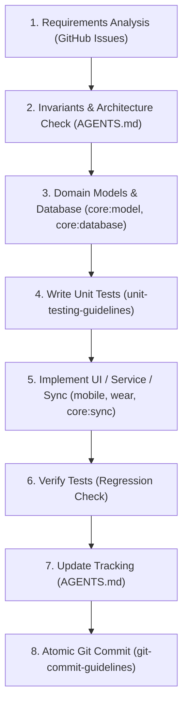

# LockerLift Feature Implementation Workflow Skill

This skill defines the structured, multi-step process for developing and delivering new features in LockerLift.

---

## 1. Overview of the Implementation Lifecycle



---

## 2. Step-by-Step Procedure

### Step 1: Requirements Analysis
* Identify the target user story and acceptance criteria in the [GitHub Issues](https://github.com/christian98b/LockerLift/issues) (e.g., `US 3.4: Erfassung von Gewicht, Wiederholungen und Kadenz`, `AK 3.4.1`–`AK 3.4.4`).
* Define the exact boundary of what will be implemented in this iteration.

### Step 2: Invariants & Architecture Check
Before writing any code, verify that the design complies with the non-negotiables in [AGENTS.md](../../../AGENTS.md):
1. **Locker Isolation:** Does this assume phone or cloud connectivity on the watch? *(Must work 100% offline).*
2. **UUID Primary Keys:** Are all new entities using `UUID.randomUUID().toString()`? *(Never use auto-increment IDs).*
3. **Template vs. Session Decoupling:** Does modifying an active session leave the template untouched unless consolidated at completion?
4. **Channel Separation:** Is master data synced via `DataClient` and workout sessions via `ChannelClient`?
5. **Health Connect:** Is Health Connect writing restricted strictly to the mobile phone module?

### Step 3: Domain Models & Database Schema
* If new entities or fields are required:
  1. Add domain models to `:core:model` (pure Kotlin, no Android dependencies).
  2. Add Room entities, migrations, and DAOs to `:core:database`.
  3. Ensure entity mappers (`toDomainModel()` and `toEntity()`) are implemented.
  4. Ensure cascade delete behavior and database indexes are explicitly defined.

### Step 4: Write Unit Tests (TDD / Test-First)
* Follow the [unit-testing-guidelines](../unit-testing-guidelines/SKILL.md) skill.
* Write unit tests for:
  * Calculations (e.g., progression logic, increments, rest timer calculations).
  * Data mappers and Room TypeConverters.
  * Serialization and deserialization round-trips.
* Place tests in `<module>/src/test/kotlin/...`.

### Step 5: Implement UI & Presentation Layer
* **Wear OS (`:wear`):**
  * Use Horologist `ScalingLazyColumn`.
  * Support Rotary Input for number inputs (reps, weight).
  * Ensure ongoing activities run inside `WorkoutForegroundService`.
* **Mobile (`:mobile`):**
  * Use Jetpack Compose Material 3.
  * Maintain clean MVVM / MVI architecture with hoisted state.

### Step 6: Run & Verify Tests
* Run the unit test suite across affected modules.
* **Regression-Free Rule:** Ensure all existing unit tests and all newly added tests pass without errors.

### Step 7: Update Implementation Tracking
* Open [AGENTS.md](../../../AGENTS.md).
* Update Section 2/3 (**Nachverfolgung von Implementierungen / Progress & Tracking**):
  * Check off completed features (`[x]`).
  * Document created/modified files.
  * Document newly added unit tests.

### Step 8: Atomic Git Commit
* Follow the [git-commit-guidelines](../git-commit-guidelines/SKILL.md) skill.
* Draft a commit message in Conventional Commits format:
  ```text
  feat(<scope>): <short imperative summary>

  - <Detail of implementation>
  - Include unit tests for <Feature>
  - Closes US-X.Y
  ```
* Ensure both the code **and** the unit tests are included in the same commit.
