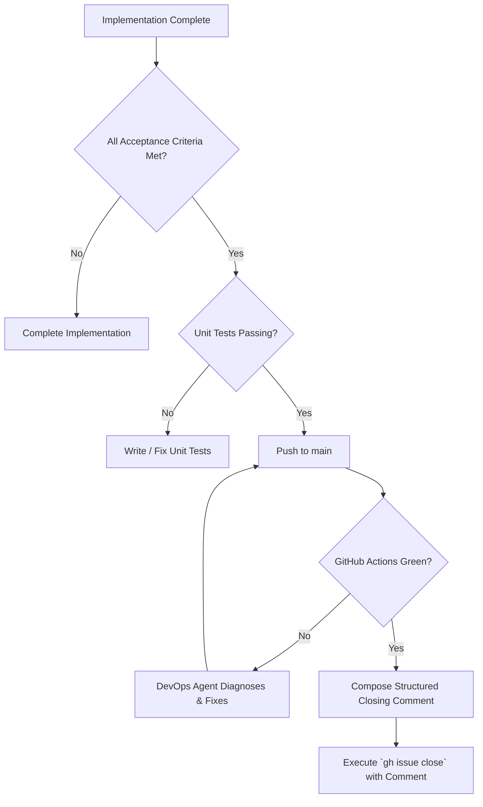

# LockerLift Issue Closing & Commenting Guide

This skill defines the authoritative procedure, quality gates, and structured templates for commenting on and closing GitHub issues in the **LockerLift** repository.

---

## 1. Core Philosophy & Quality Gates

> [!IMPORTANT]
> **Never close an issue silently or with a single-line comment.**  
> Every closed issue serves as a permanent historical audit trail for users, contributors, and AI agents. It must conclusively prove that all acceptance criteria have been satisfied and validated by automated tests and CI pipelines.

### Mandatory Pre-Close Quality Gates:
Before an issue may be marked as closed:
1. **100% Acceptance Criteria Met:** Every checkbox (`- [x] AK X.Y.Z`) defined in the issue must be fulfilled.
2. **Automated Unit Tests Included:** Corresponding unit tests covering the new behavior/logic must exist and pass.
3. **CI/CD Pipeline Green:** The GitHub Actions workflow on `main` must complete with status `success` (`Run Unit Tests` and `Build APKs for Download`).
4. **Downloadable Binaries Built:** Working APK artifacts (`mobile-debug.apk` and `wear-debug.apk`) must be produced by the pipeline.



---

## 2. Structure of an Issue Resolution Comment

Every closing comment must follow this consistent 5-part architecture:

1. **Header & Executive Summary:** States that the issue / user story has been fully implemented, verified, and merged.
2. **Acceptance Criteria Verification Matrix:** Explicitly lists each Acceptance Criterion (AK) from the issue description with checked state `[x]` and brief technical proof.
3. **Code & Test Deliverables:** Bulleted list or table of modified and created files across modules (`:core:*`, `:mobile`, `:wear`).
4. **CI/CD & Artifact Evidence:** Links the green GitHub Actions run, execution times, and downloadable APK artifact names.
5. **Commit Traceability:** Links the git commit hash(es) following Conventional Commits.

---

## 3. Standard Issue Closing Comment Template

Use the following Markdown template when crafting the closure comment:

```markdown
### ✅ Issue Resolution & Acceptance Criteria Verification

This user story has been fully implemented, verified by automated unit tests, and validated by the GitHub Actions CI/CD pipeline.

#### 1. Acceptance Criteria Breakdown
- [x] **AK X.Y.1:** <Summary of criterion 1> — *Verified via `<TestClass>.<testMethod>()`.*
- [x] **AK X.Y.2:** <Summary of criterion 2> — *Implemented in `<ClassName>` with `<Detail>`.*
- [x] **AK X.Y.3:** <Summary of criterion 3> — *Handled via `<Protocol / Architecture Detail>`.*

#### 2. Delivered Code & Test Artifacts
- **Production Code:**
  - `<module>/.../<File1>.kt`: <Brief description of changes>
  - `<module>/.../<File2>.kt`: <Brief description of changes>
- **Unit Tests:**
  - `<module>/.../<TestFile>.kt`: <Summary of test cases added>

#### 3. CI/CD Pipeline Verification
- **GitHub Actions Run:** [Run #<RUN_ID>](https://github.com/christian98b/LockerLift/actions/runs/<RUN_ID>)
- **Unit Tests:** Passed (100% green)
- **Artifacts Produced:** `<Artifact-Name>` (`mobile-debug.apk`, `wear-debug.apk`)
- **Resolved in Commit:** `<COMMIT_SHA>` (`<commit subject>`)
```

---

## 4. GitHub CLI (`gh`) Commands & Workflows

### 4.1 Closing an Issue with a Comment (Single Step)
Use the `--comment` flag on `gh issue close`:

```bash
gh issue close <ISSUE_NUMBER> --comment "### ✅ Issue Resolved
- [x] AK 1.1.1: Implemented in MachineDao & CatalogScreen
- [x] AK 1.1.2: Implemented in ActiveWorkoutScreen (Wear OS)
- [x] AK 1.1.3: Duplicate name validation verified by WearWorkoutLogicTest
Verified in CI Run https://github.com/christian98b/LockerLift/actions/runs/34768181572
Closed via commit a128a03"
```

### 4.2 Adding a Progress Comment Without Closing
If an issue is partially implemented or awaiting further integration:

```bash
gh issue comment <ISSUE_NUMBER> --body "### ⏳ Implementation Progress Update
- [x] AK 2.1.1: Implemented
- [x] AK 2.1.2: Implemented
- [ ] AK 2.1.3: Under development in :mobile
Pending CI verification."
```

### 4.3 Batch Closing Multiple Issues
When a major milestone or epic is integrated:

```bash
for issue in 1 2 3 4; do
  gh issue close $issue --comment "Resolved and verified in CI Run #34768181572 (Commit a128a03)"
done
```

---

## 5. Reopening Protocol

If a regression, bug, or unhandled edge case is discovered after an issue has been closed:

1. **Do not modify past comments.**
2. Post a new comment stating the defect with reproduction steps and failing test logs:
   ```bash
   gh issue comment <ISSUE_NUMBER> --body "### ⚠️ Regression Identified
   **Failure:** Rest timer does not pulse when watch screen is off.
   **Failing Test:** `RestTimerTest.testAmbientMode()`
   Reopening for investigation."
   ```
3. Reopen the issue:
   ```bash
   gh issue reopen <ISSUE_NUMBER>
   ```
4. Assign an Implementation Agent to deliver the fix and corresponding regression test.
