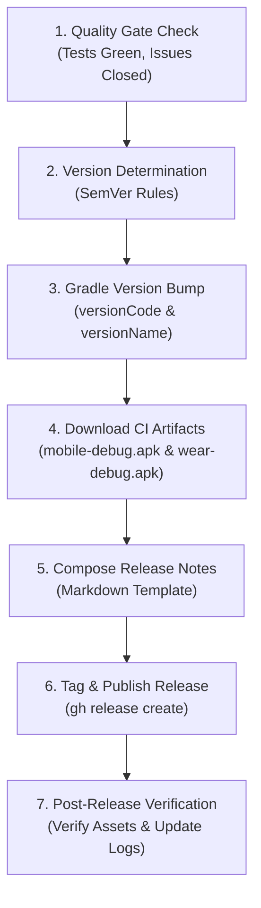

# LockerLift Release Creation Guide (`release-creation-guide`)

This skill defines the authoritative, step-by-step operational procedure for drafting, tagging, packaging, and publishing official releases of **LockerLift** for Android and Wear OS.

---

## 1. Release Lifecycle & Architecture

Every LockerLift release proceeds through a strict 7-phase sequence:



---

## 2. Pre-Release Quality Gates

Before initiating a release, verify that all four mandatory gates pass:

1. **Zero Open Milestone Issues:** All intended features, epics, or bugfixes must be closed and commented (refer to `issue-closing-and-commenting-guide`).
2. **100% Green CI Pipeline:** The latest commit on `main` must have a passing GitHub Actions workflow (`Test & Build APKs`).
3. **Automated Unit Tests Passing:** Zero test failures across `:core:model`, `:core:database`, `:core:sync`, `:core:healthconnect`, and `:wear`.
4. **Binary Artifacts Available:** Verified debug APKs for both Mobile and Wear OS produced by the CI pipeline.

---

## 3. Step-by-Step Release Workflow

### Step 1: Determine Version Bump
Consult [`.agents/skills/release-versioning-rules/SKILL.md`](../release-versioning-rules/SKILL.md):
* **MAJOR (`X.0.0`):** Breaking sync protocol changes, breaking Room database schema, dropping minSdk.
* **MINOR (`x.Y.0`):** New user-facing features (Epics, User Stories, new screens, backward-compatible additions).
* **PATCH (`x.y.Z`):** Bugfixes, performance optimizations, documentation updates, dependency bumps.

---

### Step 2: Bump Version in Gradle Configuration
Ensure both `mobile/build.gradle.kts` and `wear/build.gradle.kts` share identical version strings and strictly incrementing version codes:

```kotlin
// In mobile/build.gradle.kts & wear/build.gradle.kts:
defaultConfig {
    versionCode = CURRENT_CODE + 1 // Monotonically increasing integer (e.g., 2)
    versionName = "X.Y.Z"          // SemVer string (e.g., "1.1.0")
}
```

Commit the version bump:
```bash
git add mobile/build.gradle.kts wear/build.gradle.kts
git commit -m "chore(project): bump version to vX.Y.Z (code N)"
git push origin main
```

---

### Step 3: Fetch CI-Built APK Artifacts
Download the compiled binaries from the latest successful GitHub Actions run:

```bash
# 1. Identify successful run ID
gh run list --limit 3

# 2. Download APK artifact package
gh run download <RUN_ID> -n <ARTIFACT_NAME> -D release_apks

# 3. Flatten paths for easy attachment
cp release_apks/mobile/build/outputs/apk/debug/mobile-debug.apk release_apks/mobile-debug.apk
cp release_apks/wear/build/outputs/apk/debug/wear-debug.apk release_apks/wear-debug.apk
```

---

### Step 4: Compose Structured Release Notes
Draft the release notes in a temporary file (e.g. `release_notes_vX.Y.Z.md`). Follow this structured standard:

```markdown
# 🏋️‍♂️ LockerLift vX.Y.Z – <Short Release Title>

<1-2 paragraph executive summary highlighting the primary achievements of this release>

---

### ✨ What's New in vX.Y.Z

#### ⌚ Autonomous Wear OS Tracking (`:wear`)
* **<Feature 1>:** <Description of functionality and user benefit>
* **<Feature 2>:** <Rotary input, rest timers, progression cues, etc.>

#### 📱 Mobile Companion & Management (`:mobile`)
* **<Feature 1>:** <Catalog updates, template management, reordering>
* **<Feature 2>:** <Workout history, Health Connect settings>

#### 🔄 Synchronization & Core Engine (`:core:*`)
* **<Sync/Protocol Detail>:** <Store-and-forward improvements, schema changes, DTOs>

---

### 🐛 Bugfixes & Improvements
* Fixed <issue description> ([#X](https://github.com/christian98b/LockerLift/issues/X)).
* Improved <performance/stability detail>.

---

### 📦 Downloadable Assets
* `mobile-debug.apk`: Android Smartphone application (Android 9.0+ / API 28+).
* `wear-debug.apk`: Wear OS Smartwatch application (Wear OS 3.0+ / API 30+).

---

### 📖 Documentation
Refer to the official [User Documentation Portal](documentation/README.md) for full setup and user guides.
```

---

### Step 5: Publish Release via GitHub CLI (`gh release create`)
Create the git tag and publish the release with both APKs attached:

```bash
gh release create vX.Y.Z \
  --title "vX.Y.Z – <Release Title>" \
  --notes-file release_notes_vX.Y.Z.md \
  release_apks/mobile-debug.apk \
  release_apks/wear-debug.apk
```

> [!TIP]
> `gh release create` automatically creates and pushes the git tag `vX.Y.Z` if it does not already exist on remote.

---

### Step 6: Post-Release Verification & Housekeeping

1. **Verify Online Release:**
   ```bash
   gh release view vX.Y.Z
   ```
   Confirm that both `mobile-debug.apk` and `wear-debug.apk` are listed and downloadable.

2. **Clean Up Temporary Artifacts:**
   ```bash
   rm -rf release_apks/ release_notes_vX.Y.Z.md
   ```

3. **Update Tracking in `AGENTS.md`:**
   Add the release milestone, version code, and tag to the changelog.

---

## 4. Emergency Patch & Rollback Procedures

### Hotfix Protocol:
1. If a critical regression is discovered in production, branch from tag `vX.Y.Z`:
   ```bash
   git checkout -b hotfix/vX.Y.(Z+1) vX.Y.Z
   ```
2. Apply the minimal bugfix with a regression test.
3. Merge into `main`, bump patch version, verify green CI, and publish `vX.Y.(Z+1)`.

### Deleting an Erroneous Release / Tag:
```bash
# Delete release and remote tag
gh release delete vX.Y.Z --yes --cleanup-tag

# Delete local tag
git tag -d vX.Y.Z
```
