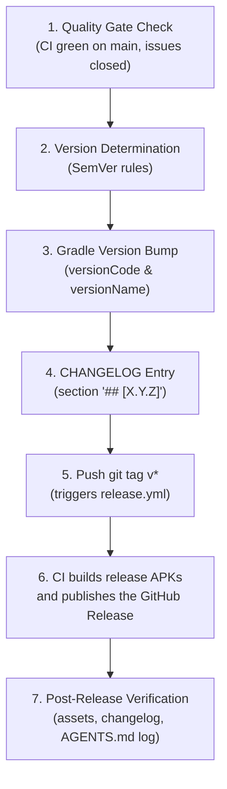

# LockerLift Release Creation Guide (`release-creation-guide`)

This skill defines the authoritative, step-by-step operational procedure for versioning,
tagging, and publishing official releases of **LockerLift** for Android and Wear OS.

> **IMPORTANT — Automation since v1.7.4:** The release is built and published entirely by
> the CI pipeline (`release.yml`, triggered by pushing a `v*` tag). Never download CI
> artifacts and attach them manually via `gh release create` — the workflow does this
> itself and publishes the release non-draft. The manual artifact-download procedure that
> older versions of this skill described is **obsolete**.

---

## 1. Release Lifecycle & Architecture

Every LockerLift release proceeds through this sequence:


```mermaid
flowchart TD
    A["1. Quality Gate Check<br/>(CI green on main, issues closed)"] --> B["2. Version Determination<br/>(SemVer rules)"]
    B --> C["3. Gradle Version Bump<br/>(versionCode & versionName)"]
    C --> D["4. CHANGELOG Entry<br/>(section '## [X.Y.Z]')"]
    D --> E["5. Push git tag v*<br/>(triggers release.yml)"]
    E --> F["6. CI builds release APKs<br/>and publishes the GitHub Release"]
    F --> G["7. Post-Release Verification<br/>(assets, changelog, AGENTS.md log)"]
```

---

## 2. Pre-Release Quality Gates

Before tagging a release, verify all mandatory gates pass:

1. **Zero Open Milestone Issues:** All intended features, epics, or bugfixes must be
   closed and commented (refer to `issue-closing-and-commenting-guide`).
2. **100% Green CI Pipeline:** The latest commit on `main` must have a passing
   `Test & Build APKs` workflow (`build-and-test.yml`).
3. **Automated Unit Tests Passing:** Zero test failures across all modules
   (`:core:*`, `:mobile`, `:wear`).
4. **Version bump committed:** `versionCode`/`versionName` updated in both
   `mobile/build.gradle.kts` and `wear/build.gradle.kts` (identical values).

---

## 3. Step-by-Step Release Workflow

### Step 1: Determine Version Bump

Consult [`.agents/skills/release-versioning-rules/SKILL.md`](../release-versioning-rules/SKILL.md):

* **MAJOR (`X.0.0`):** Breaking sync protocol changes, breaking Room database schema, dropping minSdk.
* **MINOR (`x.Y.0`):** New user-facing features (Epics, User Stories, new screens, backward-compatible additions).
* **PATCH (`x.y.Z`):** Bugfixes, performance optimizations, documentation updates, dependency bumps.

### Step 2: Bump Version in Gradle Configuration

Ensure both `mobile/build.gradle.kts` and `wear/build.gradle.kts` share identical version
strings and strictly incrementing version codes:

```kotlin
// In mobile/build.gradle.kts & wear/build.gradle.kts:
defaultConfig {
    versionCode = CURRENT_CODE + 1 // Monotonically increasing integer (e.g., 15)
    versionName = "X.Y.Z"           // SemVer string (e.g., "1.7.5")
}
```

### Step 3: Add a CHANGELOG Entry

Add a section to `CHANGELOG.md` in Keep-a-Changelog style. The release workflow extracts
the section matching the tag (`## [X.Y.Z]`) and uses it as the release body. If no
matching section exists, the workflow falls back to the entire CHANGELOG — so keep the
section heading exactly `## [X.Y.Z]`.

```markdown
## [1.7.5] - YYYY-MM-DD

### 🚀 New Features
* **<Feature>:** <Description>

### 🔧 Fixes
* **<Fix>:** <Description>
```

### Step 4: Commit, then Push the Tag

Commit the version bump and changelog, then create and push the tag. **The tag push is
the sole release trigger** — `release.yml` runs only on `on.push.tags: ['v*']`:

```bash
git add mobile/build.gradle.kts wear/build.gradle.kts CHANGELOG.md
git commit -m "chore(project): bump version to vX.Y.Z (code N)"
git push origin main

# Tag must point at the version-bump commit:
git tag vX.Y.Z
git push origin vX.Y.Z
```

> [!IMPORTANT]
> Tag a commit that is already on `main` and contains the matching version bump.
> If the tag has to be moved (e.g., release fix), delete and re-push it:
> `git push origin :refs/tags/vX.Y.Z && git tag -f vX.Y.Z <sha> && git push origin vX.Y.Z`.
> A tag re-push triggers a new release run.

### Step 5: Monitor the Release Workflow

The workflow (`release.yml`) automatically:

1. Checks out the tag.
2. Sets up JDK 21, Android SDK 35 (manual `sdkmanager` setup — the
   `android-actions/setup-android@v3` action is broken and must not be reintroduced),
   and Gradle 8.10.2.
2. Runs `gradle :mobile:assembleRelease :wear:assembleRelease` (uses the `gradle` binary;
   the repo has no `gradlew` wrapper script).
3. Renames the APKs to `mobile-release.apk` / `wear-release.apk`.
4. Publishes a **non-draft** GitHub Release named "Release vX.Y.Z" with both APKs
   attached and the extracted CHANGELOG section as body.

Monitor it:

```bash
gh run list --workflow release.yml --limit 3
gh run watch <RUN_ID> --exit-status
```

Typical duration: ~7 minutes. If the run fails, inspect
`gh run view <RUN_ID> --log`, fix on `main`, then move the tag (see Step 4 note) and
re-trigger.

### Step 6: Post-Release Verification & Housekeeping

1. **Verify the online release:**

   ```bash
   gh release view vX.Y.Z
   ```

   Confirm `mobile-release.apk` and `wear-release.apk` are attached and the changelog
   body matches the `## [X.Y.Z]` section.

2. **Verify on main:** Ensure the `Test & Build APKs` workflow for the pushed `main`
   commit is green as well.

3. **Update tracking in `AGENTS.md`:** Add the release milestone, version code, and tag
   to the progress log (as done for v1.7.3 and v1.7.4).

No local build, no artifact download, no manual APK upload is part of this procedure.

---

## 4. Signing Notes

* Without the `ANDROID_KEYSTORE_*` secrets configured in the repository, the pipeline
  builds **unsigned** release APKs. That is the current state.
* To produce signed APKs, configure the four repository secrets
  (`ANDROID_KEYSTORE_FILE`, `ANDROID_KEYSTORE_PASSWORD`, `ANDROID_KEY_ALIAS`,
  `ANDROID_KEY_PASSWORD`) as described in [`.github/README.md`](../../.github/README.md).
  No workflow change is needed — the build steps already forward these env vars.

---

## 5. Emergency Patch & Rollback Procedures

### Hotfix Protocol

1. If a critical regression is discovered in production, branch from tag `vX.Y.Z`:

   ```bash
   git checkout -b hotfix/vX.Y.(Z+1) vX.Y.Z
   ```

2. Apply the minimal bugfix with a regression test.
3. Merge into `main`, bump patch version, add changelog entry, verify green CI, and
   push tag `vX.Y.(Z+1)` to trigger the automated release.

### Deleting an Erroneous Release / Tag

```bash
# Delete release and remote tag
gh release delete vX.Y.Z --yes --cleanup-tag

# Delete local tag
git tag -d vX.Y.Z
```

> Re-pushing a tag with the same name after cleanup triggers a fresh automated release.
