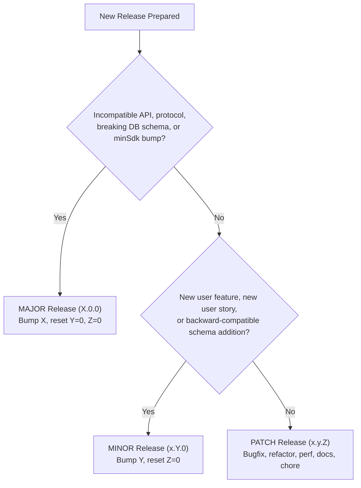

# LockerLift Release & Versioning Rules Skill

This skill defines the explicit criteria for categorizing releases into **MAJOR**, **MINOR**, and **PATCH** according to Semantic Versioning (SemVer 2.0.0) within the LockerLift ecosystem.

---

## 1. Version Format

LockerLift follows the standard Semantic Versioning scheme:

$$\text{v}\mathbf{MAJOR}.\mathbf{MINOR}.\mathbf{PATCH}$$

Example: `v1.2.0`

In Android Gradle configuration (`mobile/build.gradle.kts` and `wear/build.gradle.kts`):
* `versionName = "MAJOR.MINOR.PATCH"` (User-facing version string)
* `versionCode = Integer` (Strictly monotonic increasing integer: `1, 2, 3, ...`, incremented on **every** release)

---

## 2. Release Classification Matrix



---

## 3. Detailed Criteria

### 3.1 MAJOR Release (`X.0.0` ➔ Breaking Changes)
A **MAJOR** release is triggered when changes are **backwards-incompatible** across devices, storage, or APIs.

**Triggers in LockerLift:**
1. **Wearable Data Layer Protocol Break:**
   * Incompatible changes to `WorkoutSessionPayload` or serialization scheme where a watch running version $N$ cannot stream to a phone running version $N-1$ (or vice versa).
   * Changing or removing DataClient/ChannelClient paths in `SyncConstants`.
2. **Destructive Database Changes:**
   * Room database schema changes without a smooth, backward-compatible migration path (`fallbackToDestructiveMigration` triggered).
   * Modifying primary key formats or foreign key cascade rules that break existing user data.
3. **Platform & SDK Support Drops:**
   * Bumping `minSdk` (e.g., dropping Android 9 / API 28 on mobile or Wear OS 3 / API 30 on watch).
4. **Architectural Paradigm Shifts:**
   * Fundamental rework of core invariants (e.g. moving away from UUIDv4 PKs, changing the Store-and-Forward sync model).

---

### 3.2 MINOR Release (`x.Y.0` ➔ New Features, Backward-Compatible)
A **MINOR** release is triggered when new functionality or user stories are added in a **backwards-compatible** manner.

**Triggers in LockerLift:**
1. **User Stories & Features (`feat`):**
   * Implementation of any acceptance criteria from `USER_STORIES.md` (e.g., new Rotary Input gestures, new progression algorithms, rest timer improvements).
   * Adding new screens or UI capabilities on Mobile or Wear OS.
2. **Schema & Model Additions (Backward-Compatible):**
   * Adding new optional columns to Room entities with default values and automated migrations.
   * Introducing new entities or relations that do not break existing queries.
3. **Sync Protocol Additions:**
   * Adding optional, nullable fields to `WorkoutSessionPayload` that older clients can safely ignore.
4. **Integrations:**
   * Supporting new Health Connect record types (e.g., adding VO2 max or speed metrics).
   * Adding export/import formats (CSV, JSON, Fit).

---

### 3.3 PATCH Release (`x.y.Z` ➔ Bugfixes & Maintenance)
A **PATCH** release is triggered for backward-compatible bugfixes and internal enhancements.

**Triggers in LockerLift:**
1. **Bugfixes (`fix`):**
   * Fixing calculation errors in weight progression or rest timers.
   * Resolving ChannelClient streaming timeouts or sync reconnection retries.
   * Fixing UI rendering glitches or rotary scrolling sensitivity.
2. **Performance Optimizations (`perf`):**
   * Adding indexes to Room database tables.
   * Reducing memory footprint in foreground services or image rendering.
3. **Internal & Tooling Changes (`refactor`, `chore`, `docs`, `test`):**
   * Refactoring code without altering public behavior or schemas.
   * Updating Gradle dependencies, AGP, or Kotlin compiler version.
   * Adding or updating unit tests.
   * Documentation updates in `README.md`, `ARCHITECTURE.md`, or agent guidelines.

---

## 4. Release Checklist

When executing a release:
1. **Determine Version Bump:** Use the matrix above to decide if the release is Major, Minor, or Patch.
2. **Update Gradle Configurations:**
   * In `mobile/build.gradle.kts` and `wear/build.gradle.kts`:
     * Increment `versionCode` by 1.
     * Update `versionName` to `"X.Y.Z"`.
3. **Verify All Unit Tests:** Ensure `./gradlew test` passes 100%.
4. **Tag the Release:**
   ```bash
   git tag -a vX.Y.Z -m "Release vX.Y.Z: <Summary of changes>"
   git push origin vX.Y.Z
   ```
5. **Update Tracking:** Document the release and version bump in `AGENTS.md`.
