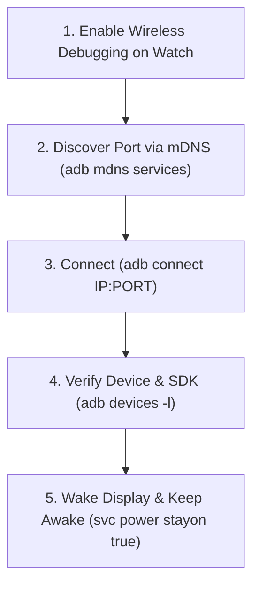

# Wear OS ADB Debugging & Testing Guide (`wear-os-adb-guide`)

This skill defines standard procedures, diagnostic patterns, and command recipes for interacting with Wear OS smartwatches (e.g., Samsung Galaxy Watch, Google Pixel Watch) over ADB via Wireless Debugging or USB.

---

## 1. Core Principles of Wear OS Debugging

Wear OS devices differ significantly from standard Android smartphones:
1. **Aggressive Display Timeouts:** Watches sleep within 5–10 seconds of user inactivity. When the display enters ambient mode or `DOZE_SUSPEND`, touch inputs are suppressed and the system freezes non-foreground apps (e.g., via Samsung MARs `MARsmini_FreecessController: freezePackage`).
2. **Dynamic Ports for Wireless Debugging:** Wear OS Wireless Debugging pairs with a random dynamic port each time Wi-Fi or debugging is toggled. Always discover the active port via mDNS or watch settings.
3. **Strict Android 14+ (targetSdk 35) Restrictions:** Health foreground services (`FOREGROUND_SERVICE_HEALTH`) require explicit service type declarations and mandatory sensor permissions (`HIGH_SAMPLING_RATE_SENSORS`, `ACTIVITY_RECOGNITION`, etc.). Missing permissions throw fatal `SecurityException` crashes upon `startForeground()`.
4. **Circular Display Geometry:** Coordinates for clicks/taps must account for round screens (typically `450x450` or `480x480`, with the center at `240, 240`).

---

## 2. Wireless ADB Connection Workflow



### 2.1 Discovering and Connecting

```powershell
# 1. Discover active mDNS services for Wear OS
adb mdns services
# Look for: adb-<DEVICE_ID>._adb-tls-connect._tcp <IP>:<PORT>

# 2. Connect to the watch
adb connect <IP>:<PORT>

# 3. Verify connection status
adb devices -l

# 4. Inspect hardware model and Android SDK version
adb shell "getprop ro.product.model; getprop ro.build.version.release; getprop ro.build.version.sdk"
# Example output for Galaxy Watch 7:
# SM-L310
# 16
# 36
```

---

## 3. Display & Power Management

During manual and automated testing, you must prevent the watch from sleeping or going into ambient mode.

### 3.1 Inspecting Screen State

```powershell
# Check current display power state (ON, DOZE, DOZE_SUSPEND)
adb shell "dumpsys display | grep -E 'mScreenState|mDisplayState'"
```

### 3.2 Waking the Watch

```powershell
# Send wakeup key event (KEYCODE_WAKEUP = 224)
adb shell input keyevent KEYCODE_WAKEUP
```

### 3.3 Keeping the Display Awake Temporarily

```powershell
# Force screen to stay awake while connected/powered
adb shell svc power stayon true

# Reset back to default system timeout when done (ephemeral, resets on reboot)
adb shell svc power stayon false
```

> [!NOTE]
> `svc power stayon` is an ephemeral setting held in volatile memory by `PowerManagerService`. It does not permanently alter system settings and automatically resets on device reboot.

---

## 4. App Launch & Focus Verification

### 4.1 Launching LockerLift Wear OS App

```powershell
# Launch MainActivity and wait until resumed
adb shell am start -W -n com.lockerlift.wear/.MainActivity
```

### 4.2 Verifying Current Focus & Task State

```powershell
# Check which window and package currently holds focus
adb shell "dumpsys window | grep -E 'mCurrentFocus|mFocusedApp'"

# Check activity stack state (RESUMED vs STOPPED)
adb shell dumpsys activity activities | Select-String -Pattern "Task.*com.lockerlift.wear" -Context 0,10
```

---

## 5. UI Interaction & Screenshot Verification

### 5.1 Taking Circular Screenshots

```powershell
# Capture on-device screenshot and pull to workspace
adb shell screencap -p /sdcard/wear_screen.png
adb pull /sdcard/wear_screen.png wear_screen.png
```

### 5.2 Simulating User Input

```powershell
# Check physical display dimensions
adb shell wm size
# e.g., Physical size: 480x480

# Tap center of the screen (e.g. primary action button)
adb shell input tap 240 250

# Simulate scroll down (drag from y=350 to y=150)
adb shell input swipe 240 350 240 150 300

# Simulate scroll up (drag from y=150 to y=350)
adb shell input swipe 240 150 240 350 300

# Send Hardware Back Key (KEYCODE_BACK = 4)
adb shell input keyevent 4
```

---

## 6. Logcat & Crash Diagnosis

### 6.1 Clearing and Capturing Exceptions

```powershell
# 1. Clear buffer before triggering action
adb logcat -c

# 2. Trigger action on the watch (via input tap or user gesture)
adb shell input tap 240 250

# 3. Read fatal Android crashes
adb logcat -d -s AndroidRuntime:E

# 4. Filter for LockerLift-specific errors and exceptions
adb logcat -d | Select-String -Pattern "lockerlift|FATAL|SecurityException|ForegroundService" -Context 3,10
```

### 6.2 Diagnosing by Process PID

```powershell
# Find current PID of LockerLift
$pid = adb shell pidof com.lockerlift.wear

# Read all logs produced specifically by this process
adb logcat -d --pid=$pid
```

---

## 7. Deploying CI/CD Artifacts via ADB

When local compilation is disabled or unavailable, fetch the built APK directly from the GitHub Actions CI pipeline:

```powershell
# 1. Check CI status
gh run list --limit 3

# 2. Download wear-debug APK artifact once green
gh run download <RUN_ID> -n wear-debug-apk

# 3. Install APK on connected watch (-r = reinstall, -d = allow version downgrade)
adb install -r -d wear-debug.apk

# 4. Confirm installation
adb shell "pm list packages | grep lockerlift"

# 5. Launch newly installed app
adb shell am start -n com.lockerlift.wear/.MainActivity
```

---

## 8. Common Wear OS Gotchas & Solutions

| Symptom | Root Cause | Solution |
|---|---|---|
| `adb.exe: device offline` | Watch screen turned off; Wi-Fi entered power-save. | Wake the watch (`input keyevent KEYCODE_WAKEUP`), reconnect (`adb connect IP:PORT`). |
| `cannot connect to IP:PORT (10060)` | Wireless Debugging toggled or dynamic port changed. | Run `adb mdns services` to discover new port. |
| `SecurityException: Starting FGS with type health ... requires permissions` | Missing required permissions for `FOREGROUND_SERVICE_HEALTH` under `targetSdk 35`. | Declare `HIGH_SAMPLING_RATE_SENSORS` and `POST_NOTIFICATIONS` in `AndroidManifest.xml`. |
| App closes immediately without crash log | Process frozen by Samsung MARs (`MARsmini_FreecessController`). | Keep display awake with `svc power stayon true` and check if activity finished gracefully. |
| Rotary bezel input not responding | Active composable not focused or `ScalingLazyListState` not attached. | Ensure `Modifier.rotaryWithScroll` or Horologist bezel handlers are active and focused. |
