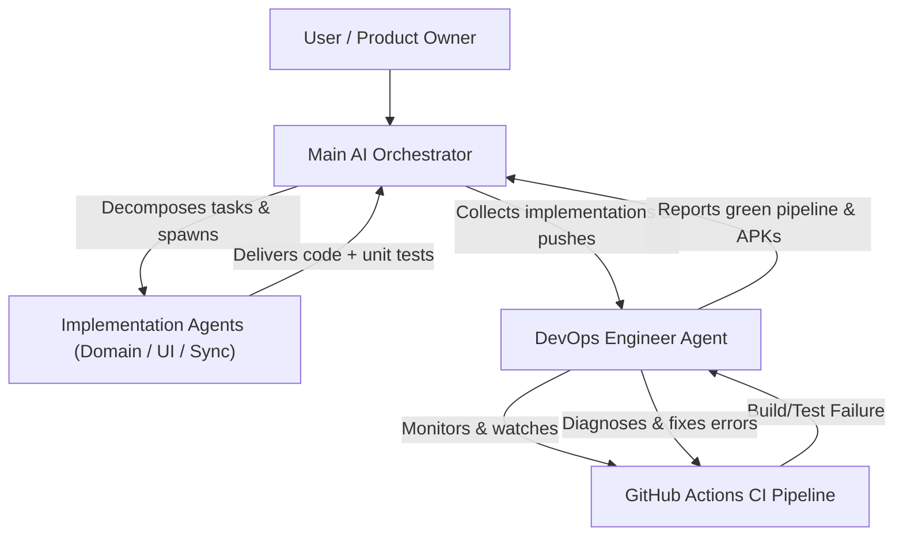

# LockerLift – AI Agent & Developer Guidelines (`AGENTS.md`)

This document serves as the authoritative handbook and progress tracking log for developers and AI assistants (e.g., Antigravity, Claude, Copilot) working on **LockerLift**. It defines guidelines, architectural mandates, testing requirements, and current implementation progress.

---

## 1. Vision & Core Philosophy of LockerLift

LockerLift is a **privacy-first, local, open-source strength training tracker** for Android and Wear OS.

### The Locker Scenario
> The smartphone remains in the locker during the entire workout. The Wear OS smartwatch operates completely autonomously without wireless connectivity (no Bluetooth, no Wi-Fi).

**Consequences for Every Code Contribution:**
* **Never** assume that a connection to the phone or internet exists during a workout on the watch.
* All CRUD actions must complete locally on the watch with zero latency and zero errors.
* Data transmission occurs strictly asynchronously following the **Store-and-Forward** principle.

---

## 2. Multi-Agent Orchestration & Workflow Model

LockerLift development is executed via an **autonomous multi-agent hierarchy**:



### 2.1 Agent Roles & Responsibilities

1. **Main AI Orchestrator:**
   * Acts as the primary interface to the user and overall project architect.
   * Analyzes user requests, maintains architectural invariants, and decomposes goals into modular implementation tasks.
   * Spawns specialized **Implementation Agents** as needed across modules (`:core:*`, `:mobile`, `:wear`).
   * Collects and integrates deliverables from all implementation agents once their work is completed.
2. **Implementation Agents:**
   * Autonomous subagents assigned to specific domain logic, screens, DAOs, or sync features.
   * Adhere strictly to the unit testing mandate: write tests concurrently with code (`AAA` pattern).
   * Report diffs, files created/modified, and test outcomes back to the Main AI Orchestrator.
3. **DevOps Engineer Agent:**
   * Spawned by the Main AI Orchestrator after implementations are consolidated and pushed to the repository.
   * Monitors and watches GitHub Actions CI/CD workflows (`gh run list`, `gh run watch`).
   * Inspects runner logs, diagnoses build, compilation, classpath, or test failures on GitHub, and fixes them autonomously.
   * Ensures the entire CI pipeline turns green and downloadable APK artifacts are produced.

---

## 3. Strict Unit Testing Mandate

> [!IMPORTANT]
> **Unit tests are mandatory for every implementation:**
> 1. **100% Test Coverage for Logic:** Every new function, business logic, calculation (e.g., Double Progression, cadence), data model, mapping, conversion, serialization, and DAO workflow **MUST** be covered by automated unit tests.
> 2. **Existing Tests Must Always Pass:** All existing unit tests must run cleanly without regressions when making future changes or additions.
> 3. **Rule on Modifying Tests:** A unit test may **only** be modified or deleted if the specifically tested feature was intentionally removed or superseded by a new specification.
> 4. **Future-Proofing:** Future implementations must actively leverage and expand existing test suites. Before finishing any task, verify that all tests for the module are green.

---

## 4. Implementation Progress & Tracking

> [!NOTE]
> **Mandatory for every agent:** Whenever new features are implemented, adjusted, or extended, this section in `AGENTS.md` **MUST** be updated immediately. Document:
> * Which feature / user story was implemented.
> * Which files were created or modified.
> * Which unit tests were added.

### Current Implementation Status

#### Status Overview

- [x] **Project Setup & Multi-Module Architecture**
  - Root Gradle Configuration: `settings.gradle.kts`, `build.gradle.kts`, `gradle.properties`, `gradle/libs.versions.toml`, `.gitignore`.
  - Module Structure: `:core:model`, `:core:database`, `:core:sync`, `:core:healthconnect`, `:mobile`, `:wear`.
- [x] **Documentation & Issue Tracking**
  - `README.md` (Project overview, tech stack, and user guides index)
  - `documentation/` (Official user documentation portal: getting started, locker scenario guide, wear OS tracking guide, mobile app guide, FAQ & troubleshooting)
  - GitHub Issues #1–#23 (Epics 1–6 + US 7.1/7.2, UX & Sync enhancements #20, #21, #22, #23)
  - `ARCHITECTURE.md` (System design, ERD, Wearable Data Layer protocols, Health Connect)
  - `AGENTS.md` (Developer & agent guidelines with multi-agent orchestration, testing mandate & changelog)
- [x] **Internationalization (i18n)**
  - English (default) and German (`values-de/`) language support across `:mobile` and `:wear`.
  - All user-facing strings migrated to `res/values/strings.xml` and `res/values-de/strings.xml`.
  - Project documentation standardized in English.
- [x] **Epic 1 & 2: Data Foundations & Models (`:core:model`, `:core:database`)**
  - Domain classes: `Machine`, `WorkoutTemplate`, `TemplateMachineCrossRef`, `WorkoutSession`, `SessionMachineInstance`, `WorkoutSet`, `SyncQueueItem`, `SetType`, `SyncStatus`, `QueueStatus`.
  - Room Entities with Cascade Delete, indices, and mappers (`MachineEntity`, `WorkoutTemplateEntity`, `TemplateMachineCrossRefEntity`, `WorkoutSessionEntity`, `SessionMachineInstanceEntity`, `WorkoutSetEntity`, `SyncQueueEntity`).
  - DAOs: `MachineDao`, `WorkoutTemplateDao`, `WorkoutSessionDao`, `SyncQueueDao`.
  - Relations: `WorkoutTemplateWithMachines`, `WorkoutSessionWithDetails`.
  - `WorkoutSessionDao.getLastCompletedSetsForMachine`: historical sets query for double progression and past performance (US 4.1).
  - `WorkoutTemplateDao.getCrossRefsForTemplate` & `getMachinesForTemplateOrdered` for ordered template exercises (US 2.1).
  - `Converters` for Room enums and `LockerLiftDatabase` builder.
- [x] **Epic 5: Wearable Data Layer Synchronization (`:core:sync`)**
  - `SyncConstants` (Paths for DataClient, ChannelClient, MessageClient).
  - DTOs: `WorkoutSessionPayload`, `SessionMachineInstancePayload`, `WorkoutTemplatePayload`.
  - `SyncPayloadSerializer` (Kotlinx Serialization JSON with type safety, session, template list, and machine catalog serializers).
  - `WearableDataLayerManager` (Streaming via `ChannelClient`, Master Data via `DataClient`, ACK via `MessageClient`).
  - Master data synchronization of templates and catalog from mobile to watch via `DataClient` (US 5.2, AK 5.2.1).
  - `SyncQueueWorker` (WorkManager task for background transfer upon reconnect).
- [x] **Epic 6: Health Connect Integration (`:core:healthconnect`)**
  - `HealthConnectManager` with SDK status, granular permission checking (`WRITE_EXERCISE`, `WRITE_TOTAL_CALORIES_BURNED`, `WRITE_HEART_RATE`), and silent fallback on denied telemetry.
  - `ExerciseRecordBuilder` (`EXERCISE_TYPE_STRENGTH_TRAINING`, `TotalCaloriesBurnedRecord`, `HeartRateRecord` with sample bounds safeguards).
- [x] **Epic 1, 2 & 4: Mobile App (`:mobile`)**
  - `MainActivity` with bottom navigation and localized tabs.
  - `CatalogScreen` (Machine catalog management, duplicate name validation, edit machine, Wear OS catalog replication via `DataClient`, localized strings).
  - `TemplateListScreen` (Template management, reordering exercises via Move Up/Down [AK 2.1.3], adding exercises via catalog picker [AK 2.2.1], removing exercises leaving catalog intact [AK 2.2.2], Wear OS templates replication via `DataClient` [US 5.2], localized strings).
  - `HistoryScreen` (Past sessions, set breakdown, localized strings).
  - `MobileTrackingScreen`: Full standalone active workout tracking parity with Wear OS (free workout, template selection, station management, rep/weight input with quick steppers, double progression suggestion banner, rest timer with countdown, ad-hoc machine creation, station skip/replace, template consolidation prompt, Health Connect export, and Wearable sync).
  - `MobileDataLayerListenerService` (Reception via `ChannelClient`, Room insert, Health Connect trigger & ACK, plus bidirectional ACK processing from Wear OS).
- [x] **Epic 3 & 4: Standalone Wear OS Tracking (`:wear`)**
  - `WorkoutForegroundService` with Ongoing Activity notification & WakeLock.
  - `MainActivity` with template selection & free workout (localized strings).
  - `ActiveWorkoutScreen` (Exercise list, machine catalog selection, ad-hoc machine creation with duplicate check [US 1.1, AK 1.1.2, AK 1.1.3], station replacement [US 3.3, AK 3.3.2], settings note editing with catalog persistence [US 1.2, AK 1.2.2], station skipping [AK 3.3.1], template consolidation, queue persistence, localized strings).
  - `RepsWeightInputScreen` (Rotary input support, quick buttons, double progression overload suggestion, historical reference data card & prefill [US 4.1, AK 4.1.1], localized strings).
  - `RestTimerScreen` (Rest timer with haptic vibration, localized strings).
  - `WearWorkoutLogic` (Pure domain logic delegating to shared `WorkoutTrackingLogic`).
  - `WearDataLayerListenerService` (Master data sync for catalog and templates, bidirectional workout session reception from phone via `ChannelClient`, ACK dispatch).
- [x] **Bidirectional Workout History Synchronization (`:core:sync`, `:mobile`, `:wear`)**
  - Symmetric workout session streaming: workouts tracked on either phone or watch stream via `ChannelClient` (`/workout_payload_transfer`) to the companion device.
  - Automatic ingestion into Room DB for both devices ensuring identical past performance logs (`getLastCompletedSetsForMachine`), prefilling, and double progression baseline.
- [x] **Security & Privacy Hardening (Audit Remediation)**
  - `AesGcmHelper`: Cryptographic utility for hardware-grade AES-256-GCM encryption, decryption, and secure random byte generation.
  - `DatabaseKeyManager`: AndroidKeyStore-backed master key lifecycle manager encrypting SQLCipher 256-bit passphrase at rest.
  - `LockerLiftDatabase`: Active SQLCipher encryption integration with `SupportOpenHelperFactory`, automatic migration of existing plaintext SQLite databases, and removal of destructive migration fallback (`fallbackToDestructiveMigration`).
  - OS Backup Hardening: Disabled unencrypted automatic backups (`android:allowBackup="false"`) with explicit XML data extraction and backup rules (`data_extraction_rules.xml`, `backup_rules.xml`) across `:mobile` and `:wear`.
  - Channel Stream Bounding: Enforced 5 MB maximum stream threshold in `MobileDataLayerListenerService` and `WearDataLayerListenerService` to prevent OOM/DoS attacks.
  - Node Capability Verification: Added capability declarations (`wear.xml`) for `lockerlift_mobile_app` and `lockerlift_wear_app`, and sender authorization checks in listener services.
  - Health Connect Standards: Added `ACTION_SHOW_PERMISSIONS_RATIONALE` and `VIEW_PERMISSION_USAGE` alias in mobile manifest, and dynamic local timezone offset calculation in `ExerciseRecordBuilder`.
  - Domain Input Bounds: Added weight clamping (`0.0f..1000.0f` kg) and rep clamping (`1..999`) in `WorkoutTrackingLogic`.
  - Release Optimization & Privacy: Added `proguard-rules.pro` stripping debug logging in release builds and retaining Room, SQLCipher (`net.zetetic`), and serialization classes.
  - Fixed AndroidKeyStore AES-GCM startup crash: encryption now uses the provider-generated IV required by hardware-backed keys; the IV is retained for decryption.
  - Fixed SQLCipher 4.17.0 `UnsatisfiedLinkError` startup crash: `LockerLiftDatabase.buildDatabase` now calls `System.loadLibrary("sqlcipher")` before any database operation, per the `sqlcipher-android` migration requirement (the 4.17 native binary registers JNI methods via `JNI_OnLoad`/`RegisterNatives`, so without explicit loading the first DB access throws `nativeOpen` `UnsatisfiedLinkError`). Affects both `:mobile` and `:wear` via shared `:core:database`.
  - Fixed `WorkoutForegroundService` `SecurityException` crash on Wear OS / Android 14+ (Issue #19): Added required `HIGH_SAMPLING_RATE_SENSORS`, `POST_NOTIFICATIONS`, `ACTIVITY_RECOGNITION`, and `BODY_SENSORS` permissions for `FOREGROUND_SERVICE_HEALTH` compatibility under `targetSdk = 35`; updated `onStartCommand` to specify `ServiceInfo.FOREGROUND_SERVICE_TYPE_HEALTH` on API 34+; guarded service start/stop operations with `runCatching`; refactored session initialization to `WearWorkoutLogic.initializeSessionInstances`.
- [x] **Unit Testing Suite (`:core:model`, `:core:sync`, `:core:database`, `:core:healthconnect`, `:mobile`, `:wear`)**
  - `DomainModelTest.kt`: Tests for instantiation, UUIDs, defaults, and JSON serialization.
  - `SyncPayloadSerializerTest.kt`: Tests for lossless encoding/decoding of complex workout payloads, `WorkoutTemplatePayload`, and machine catalogs.
  - `EntityMappingTest.kt`: Tests for bidirectional mappings, type converters, `getLastCompletedSetsForMachine` query contract verification, and sync status updates.
  - `WorkoutTrackingLogicTest.kt`: Unit tests for double progression calculations, clamping, validation, and station operations.
  - `AesGcmHelperTest.kt`: Tests for AES-256-GCM encryption, decryption roundtrip, invalid key rejection, IV/ciphertext tampering detection, and key reconstruction.
  - `AesGcmHelperTest.kt`: Verifies that encryption retains the provider-generated 12-byte GCM IV for successful decryption.
  - `ExerciseRecordBuilderTest.kt`: Tests for `ExerciseSessionRecord`, `TotalCaloriesBurnedRecord`, and `HeartRateRecord` builders, boundary safeguards, dynamic system zone offset resolution, and custom zone offset propagation.
  - `MobileWorkoutTrackingTest.kt`: Unit tests for mobile session instances, set volume calculations, double progression triggers, template variation detection, and payload serialization.
  - `WearWorkoutLogicTest.kt`: Tests for double progression calculation, historical reference data extraction & formatting, machine replacement, station skip toggle, name validation, weight/reps prefilling, input boundary clamping (`clampWeight`, `clampReps`), and session instances initialization for template and free workouts.

- [x] **Agent Skills (`.agents/skills/`)**
  - `git-commit-guidelines`: Skill enforcing Conventional Commits, scope validation, and mandatory test inclusion.
  - `unit-testing-guidelines`: Guide for automated unit tests (AAA pattern, mappers, serializers, Room, invariants).
  - `feature-implementation-workflow`: End-to-end workflow for implementing new features and user stories.
  - `release-versioning-rules`: Rules and criteria for SemVer release bumps (Major vs. Minor vs. Patch) and Gradle version bumps.
  - `release-creation-guide`: End-to-end operational guide for drafting, tagging, packaging, and publishing official releases via GitHub CLI.
  - `internationalization-guide`: Standards and procedures for adding new language locales and managing strings across mobile and wear.
  - `user-documentation-guide`: Guidelines and standards for writing structured, accessible, and user-centric documentation.
  - `issue-creation-guide`: Standards, templates, and best practices for authoring and filing high-quality GitHub issues.
  - `issue-closing-and-commenting-guide`: Standards, quality gates, and structured Markdown templates for verifying, commenting on, and closing GitHub issues.
  - `wear-os-adb-guide`: Standard operating procedures, diagnostic recipes, display management, and deployment workflows for Wear OS smartwatches via ADB.
- [x] **Official Releases**
  - `v1.0.0`: Initial production release with full offline tracking, rotary controls, template management, sync protocol, Health Connect, and standalone APK binaries.
  - `v1.1.0`: Standalone Phone Workout Tracking, Bidirectional Session History Sync, SQLCipher AES-256 DB Encryption, Security & Privacy Hardening, and Clamped Validation.
  - `v1.2.0`: Local Storage Backup & Restore with SAF, GZip/JSON export, SHA-256 integrity verification, automated periodic backup worker, and settings UI.
  - `v1.2.1`: Patch release fixing the SQLCipher 4.17.0 `UnsatisfiedLinkError` startup crash via explicit `System.loadLibrary("sqlcipher")` in the database builder (code 4).
  - `v1.3.0`: Minor feature release delivering full Workout History Editing & Deletion on Mobile (Issue #20), Wear OS Tracking UX Enhancements with Workout Pause/Resume, Configurable Rest Timer, and in-workout set editing (Issue #21), and Companion Connection Status & Manual Sync Configuration (US 5.3 / Issue #22) (code 5).
  - `v1.3.1`: Patch release unifying `applicationId = "com.lockerlift"` across `:mobile` and `:wear` modules and registering modern `wear_capabilities.xml` manifest declarations, fixing Google Play Services Wearable Data Layer companion discovery and sync isolation (code 6).
  - `v1.4.0`: Minor feature release delivering Intuitive Mobile Live Workout Tracking with Set Table & Previous Performance Comparison, Live In-Workout Set Editing & Deletion, Equipment Swapping preserving logged sets, Station Reordering, Smart Next-Station Flow, and Wear OS Always-In-Foreground Tracking & Wake Behavior (code 7).
- [x] **Mobile Live Workout Tracking UX Overhaul & Set Table Parity (`:mobile`, `:core:database`)**
  - `MobileTrackingScreen`: Overhauled active tracking with a structured set table (`SET | PREVIOUS | KG | REPS | STATUS`), side-by-side historical reference comparison per set, immediate visual feedback (`✓ Logged`) solving Jetpack Compose state recomposition delay, in-workout set editing and set deletion directly from completed rows with automatic contiguous re-indexing (`1..N`), clean 3-dots secondary actions menu (`[ ⋮ ]`) supporting on-the-fly equipment swapping while preserving logged sets (`swapMachinePreservingSets`), device setting notes editing, station reordering (`reorderInstances` up/down), exercise removal (`removeInstanceFromSession`), and smart next-station recommendation (`findNextUnfinishedStationIndex`) with freedom to select any station without cluttering buttons.
  - `WorkoutTrackingLogic` (`:core:database`): Added domain methods `updateSetInList`, `deleteSetAndRenumber`, `reorderInstances`, `removeInstanceFromSession`, `swapMachinePreservingSets`, and `findNextUnfinishedStationIndex`, with pure delegation from `WearWorkoutLogic` to eliminate code duplication.
- [x] **Wear OS Always-In-Foreground & Ambient Screen Management (`:wear`)**
  - `AndroidManifest.xml` (`:wear`): Removed empty `taskAffinity=""`, configured `android:launchMode="singleTask"`, `android:showWhenLocked="true"`, and `android:turnScreenOn="true"` on `MainActivity`.
  - `MainActivity.kt` (`:wear`): Added `setShowWhenLocked(true)` and `setTurnScreenOn(true)` on API 27+, with `FLAG_KEEP_SCREEN_ON` managed during active workout sessions so raising the wrist or tapping wakes directly back to the active workout without dropping back to the watch face.
  - `WorkoutForegroundService.kt` (`:wear`): Updated notification builder with `singleTop` intent flags, `NotificationCompat.CATEGORY_WORKOUT`, `NotificationCompat.VISIBILITY_PUBLIC`, and `NotificationCompat.PRIORITY_HIGH`.
- [x] **Issue #21: Wear OS Tracking UX Enhancements (:wear)**
  - Workout Pause & Resume in ActiveWorkoutScreen with foreground service persistence (Invariant 5), pause state management, and active session duration adjustment.
  - Intuitive Set Logging -> Rest Timer -> Next Set sequence with labeled step (Set X logged), Next Set continuation preselecting the next set, and Next Exercise navigation.
  - Configurable Rest Timer with persistent default duration (WearPreferences), real-time +/- 15s adjustment buttons without timer reset, and Skip Rest / Next Set actions.
  - Clear 'Skip Exercise' / 'Übung überspringen' labeling and informative status text to distinguish station skipping from set deletion.
  - In-workout set editing and set deletion directly from exercise cards, with clamped weight/reps and sequential renumbering (1..N).
  - All new user-facing strings localized in English (alues/strings.xml) and German (alues-de/strings.xml).
  - Pure unit tests in WearWorkoutLogicTest.kt (expanded to 42 tests) covering rest timer calculation/bounds, set update & deletion with renumbering, pause/resume transitions, and station navigation.
- [x] **US 7.2: Local Storage Backup & Restore (`:mobile`)**
  - `LocalBackupManager` (SAF-based export/restore, GZip + JSON via `SyncPayloadSerializer`, SHA-256 checksum, retention pruning).
  - `LocalBackupWorker` (`CoroutineWorker` / `PeriodicWorkRequest` for scheduled backups with configurable interval and keep-count).
  - `BackupResult` sealed class (`Success(fileName)`, `Error(message)`).
  - `SettingsScreen` (new Settings tab in bottom navigation: folder picker with `takePersistableUriPermission`, manual export, restore with schema validation, schedule dropdown (Disabled / Daily / Weekly), keep-count filter chips (3 / 5 / 10), share via `Intent.ACTION_SEND`).
  - `MainActivity` updated with `SETTINGS` tab and `Icons.Default.Settings` nav bar item.
  - `libs.versions.toml`: added `androidx-documentfile = 1.0.1` catalog entry.
  - `mobile/build.gradle.kts`: added `kotlin.serialization` plugin, `androidx.documentfile`, `kotlinx.serialization.json` dependencies.
  - `LocalBackupManagerTest.kt`: 8 pure JVM unit tests (GZip roundtrip, SHA-256 checksum consistency, filename pattern, schema version, `BackupResult.Success/Error`, empty GZip, distinct hash collision resistance).
  - All user-facing strings in EN (`values/strings.xml`) and DE (`values-de/strings.xml`): `tab_settings`, `settings_title`, and 22 `settings_*` keys.
  - Covers AK 7.2.1 (SAF directory picker), AK 7.2.2 (manual backup), AK 7.2.3 (scheduled backups + retention), AK 7.2.4 (restore + integrity validation), AK 7.2.5 (sharesheet).
- [x] **Issue #20: Edit and Delete Past Workouts in Mobile History (`:mobile`, `:core:database`, `:core:sync`, `:core:healthconnect`, `:wear`)**
  - `HistoryScreen` (`:mobile`): Edit affordance opening full modal dialog (`EditWorkoutSessionDialog`), set value editing (weight in kg, reps) with steppers and clamping (`WorkoutTrackingLogic.clampWeight` [0.0-1000.0 kg], `clampReps` [1-999]), adding new sets, deleting sets with contiguous re-indexing, removing entire machine instances leaving catalog intact, delete affordance with confirmation dialog.
  - `WorkoutSessionDao` (`:core:database`): Added `deleteMachineInstancesBySessionId(sessionId)` and updated `upsertFullSession` transaction to cleanly purge old instances/sets before inserting updated graphs, preventing orphaned records.
  - `SyncConstants` & `WearableDataLayerManager` (`:core:sync`): Added `PATH_WORKOUT_DELETE = "/workout_delete"`, `ACTION_DELETE = "DELETE"`, and `sendWorkoutDelete(nodeId, sessionId)`.
  - `SyncQueueWorker` (`:core:sync`): Added background dispatch for `ACTION_DELETE` items via `sendWorkoutDelete`.
  - `WearDataLayerListenerService` (`:wear`) & `MobileDataLayerListenerService` (`:mobile`): Added bidirectional handling for `PATH_WORKOUT_DELETE` to delete local session, cascade instances/sets, remove queue items, and trigger Health Connect deletion.
  - `ExerciseRecordBuilder` & `HealthConnectManager` (`:core:healthconnect`): Set `clientRecordId = session.id` in `ExerciseSessionRecord` metadata; added `deleteWorkoutSession(sessionId)` deleting matching records via `clientRecordIdsList = listOf(sessionId)`.
  - Localization (`:mobile`): Added all EN (`values/strings.xml`) and DE (`values-de/strings.xml`) string resources with 1:1 parity (`history_edit_workout`, `history_delete_workout`, `history_delete_dialog_title`, `history_delete_dialog_confirm`, `history_edit_title`, `history_add_set`, `history_delete_set`, `history_remove_exercise`, `history_remove_exercise_confirm`, `history_set_format`, `history_weight_kg`, `history_reps`, `history_save_changes`, `history_discard_changes`, `history_notes`).
  - Unit tests added:
    - `MobileWorkoutHistoryTest.kt` (`:mobile`): 8 tests covering updating past session sets with validation and clamping, adding sets, deleting sets with contiguous re-indexing, removing machine instances leaving catalog intact, deleting workout session with cascade simulation, re-sync payload generation, Health Connect record ID matching, and localization keys parity across EN and DE.
    - `EntityMappingTest.kt` (`:core:database`): Added `testDeleteMachineInstancesContract_cascadesSetsAndLeavesCatalogIntact`.
    - `ExerciseRecordBuilderTest.kt` (`:core:healthconnect`): Added assertion for `clientRecordId == session.id`.
- [x] **US 5.3 / Issue #22: Companion Connection Status & Manual Sync Configuration (Mobile & Wear OS)**
  - `CompanionDeviceStatus`, `CompanionNodeInfo`, `SyncResult`, `CompanionStatusResolver`, `SyncUtils` (`:core:sync`).
  - `WearableDataLayerManager`: companion status resolution (`getCompanionStatus`, `getWearCompanionStatus`, `getMobileCompanionStatus`), reachability inspection, `flushPendingQueue`, and `last_sync_timestamp` persistence in `SharedPreferences`.
  - `SyncQueueDao`: added `getPendingQueueCountFlow()` and `getPendingQueueCount()`.
  - `SyncQueueWorker`: updated to delegate queue flushing to `WearableDataLayerManager.flushPendingQueue` with `enqueue` helper.
  - `MobileDataLayerListenerService` & `WearDataLayerListenerService`: persistent `last_sync_timestamp` tracking on incoming data payloads, catalog updates, and ACK packets.
  - Mobile `SettingsScreen`: dedicated 'Wear OS Companion & Sync' section with live connection badge, last sync timestamp, pending queue counter, 'Sync Master Data Now' button with progress indicator, and 'Sync Workouts Now' button with feedback.
  - Wear OS `WearSettingsScreen`: dedicated configuration screen for round displays using `ScalingLazyColumn`, rotary scroll input, live smartphone connection badge, offline queue counter, 'Sync Now' button, visual and haptic feedback (`WearSettingsLogic`), last sync timestamp, app version display, and back button.
  - Wear OS `MainActivity`: navigation state and entry point button in `TemplateSelectionScreen`.
  - Localization: full English (`values/strings.xml`) and German (`values-de/strings.xml`) strings across `:mobile` and `:wear`.
  - Unit Tests: `CompanionStatusResolverTest.kt` (node state resolution, fallback behavior, timestamp formatting, `SyncResult` contracts), `WearSettingsLogicTest.kt` (formatting for connection and queue status, fallbacks), and `EntityMappingTest.kt` (`SyncQueueDao` pending count query contract).
- [x] **CI/CD Pipeline & Build Remediation (`.github/workflows/build-and-test.yml`)**
  - Automated GitHub Actions pipeline with `test` stage (unit tests) and `build-apks` stage (debug APKs for Mobile & Wear OS ready for download).
  - Remediation for Issues #20-#22: Restored full localized strings schema across mobile screens (`values/strings.xml` and `values-de/strings.xml`) and fixed unescaped format specifier dollar signs in `WearSettingsLogicTest.kt`. Full pipeline green (`#34879524027`).
- [x] **16 KB Page-Size Compatibility Remediation**
  - Upgraded the Compose BOM to `2025.08.01` and pinned `androidx.graphics:graphics-path` to `1.1.0` for the current native graphics artifact while retaining SDK 35 compatibility.
  - Upgraded `net.zetetic:sqlcipher-android` from `4.5.5` to `4.17.0`, the latest SDK 35-compatible release.
  - Verified AGP `8.7.2` already satisfies the required 16 KB APK packaging support.

---

## 5. Immutable Architectural Invariants

1. **UUIDs as Primary Keys:**
   * Always use `java.util.UUID.randomUUID().toString()` as the primary key for all entities.
   * **Never** use `autoGenerate = true` on Room IDs! Distributed offline databases require collision-free keys.
2. **Decoupling of Template and Session:**
   * A `WorkoutSession` copies template machines into `SessionMachineInstance` records.
   * Modifying, adding, or skipping machines during a workout does **not** automatically alter the underlying template.
   * Only upon workout completion is the user explicitly prompted whether variations should be consolidated back into the template.
3. **Data Layer API Channel Separation:**
   * **`DataClient`**: For master data (machines, templates).
   * **`ChannelClient`**: For complete workout sessions (JSON payload via byte stream).
   * **`MessageClient`**: For acknowledgment packets (ACK) and control messages.
4. **Health Connect Belongs Strictly on the Smartphone:**
   * The Wear OS app does **not** write directly to Health Connect.
   * The Wear OS app streams aggregated workout sessions to the phone via sync, which then persists the `ExerciseSessionRecord` into Health Connect.
5. **Foreground Service for Wear OS Tracking:**
   * An active workout on the watch must run inside an Android `Foreground Service` registering an `Ongoing Activity` notification. This prevents the OS from killing the process during ambient mode or memory pressure.

---

## 6. Module Structure & Package Organization

Root package: `com.lockerlift`

| Module | Gradle Path | Purpose | Allowed Dependencies |
|---|---|---|---|
| Domain Models | `:core:model` | Pure Kotlin classes, enums, value objects | **No** Android framework libraries |
| Database | `:core:database` | Room DB, entities, DAOs, SQLCipher | `:core:model`, Room, Coroutines |
| Synchronization | `:core:sync` | Wearable Data Layer Manager, serialization | `:core:model`, `:core:database`, Play Services Wearable |
| Health Connect | `:core:healthconnect` | Health Connect client, record builder | `:core:model`, AndroidX Health Connect |
| Mobile App | `:mobile` | Smartphone Compose UI, tracking, listener service | All `:core:*` modules |
| Wear OS App | `:wear` | Compose for Wear OS, Horologist, Rotary, service | `:core:model`, `:core:database`, `:core:sync` |

> [!IMPORTANT]
> Strictly respect module boundaries! `:core:model` must never contain Android imports. `:wear` must never reference `:core:healthconnect`.

---

## 7. Code Conventions & Best Practices

### 7.1 Kotlin & Coroutines
* **Null Safety:** Prefer non-nullable types. Avoid `!!` without exception.
* **Coroutines Dispatcher:**
  * UI / ViewModels: `viewModelScope.launch` on `Dispatchers.Main`.
  * Database & IO: All DAO functions are `suspend` or return `Flow<T>`. Room automatically switches to a background dispatcher.
  * Heavy Computation / Parsing: `withContext(Dispatchers.Default)`.
* **State Management:**
  * ViewModels expose `StateFlow<UiState>` via `asStateFlow()`.
  * One-off events (navigation, snackbars, haptics) are handled via `SharedFlow` or `Channel`.

### 7.2 Jetpack Compose & Wear OS Compose
* **State Hoisting:** UI components are stateless whenever possible.
* **Wear OS Horologist:**
  * Use Horologist `ScalingLazyColumn` with appropriate content padding for round displays.
  * Support Rotary Input (rotatable bezel) for weight and rep adjustments.
* **Haptics:**
  * Use `LocalHapticFeedback.current` for clicks on rotary steps and completion of sets or rest timer expiration.

### 7.3 Room Database
* All foreign keys define explicit cascade delete behavior (`onDelete = ForeignKey.CASCADE` for child elements such as sets).
* Create indices for all foreign keys and frequently queried columns (e.g., `machine_id`, `session_id`).
* Complex write operations (e.g., workout completion, sync import) must be encapsulated in `@Transaction` methods.

---

## 8. Git & Commit Guidelines (Commit Message Guidelines)

All commits must adhere to the **Conventional Commits** standard (v1.0.0). This ensures a clean project history, automatic changelog generation, and full traceability.

### Format
```text
<type>(<scope>): <short imperative summary>

[Optional detailed body: context, motivation, architectural decisions, what changed and why]

[Optional footer: references to user stories or issue tracking, e.g. 'Closes US-3.1']
```

### 8.1 Allowed Types (`type`)
* `feat`: New user feature (e.g., new screen, progression logic).
* `fix`: Bugfix or correction of unexpected behavior.
* `test`: Adding, updating, or fixing unit tests.
* `docs`: Documentation changes only (`README.md`, `AGENTS.md`, etc.).
* `refactor`: Code restructuring without adding functionality or fixing bugs.
* `chore`: Build configuration, Gradle updates, version bumps, `.gitignore`.
* `perf`: Performance optimizations.

### 8.2 Allowed Scopes (`scope`)
* `model`: Changes in `:core:model`
* `database`: Changes in `:core:database`
* `sync`: Changes in `:core:sync`
* `healthconnect`: Changes in `:core:healthconnect`
* `mobile`: Changes in `:mobile`
* `wear`: Changes in `:wear`
* `project`: Cross-cutting changes affecting multiple modules or root setup

### 8.3 Mandatory Commit Rules
1. **Imperative Mood / Present Tense:** Write `feat(wear): add rotary input support` instead of `added rotary input`.
2. **No Trailing Period:** The subject line must **never** end with a period.
3. **Subject Length:** Keep the first line strictly under 72 characters.
4. **Atomic Commits:** Each commit must encapsulate a single logical change.
5. **Commit Tests with Features:** When introducing a new feature (`feat(...)`), the corresponding unit tests **MUST** be included in the exact same commit.
