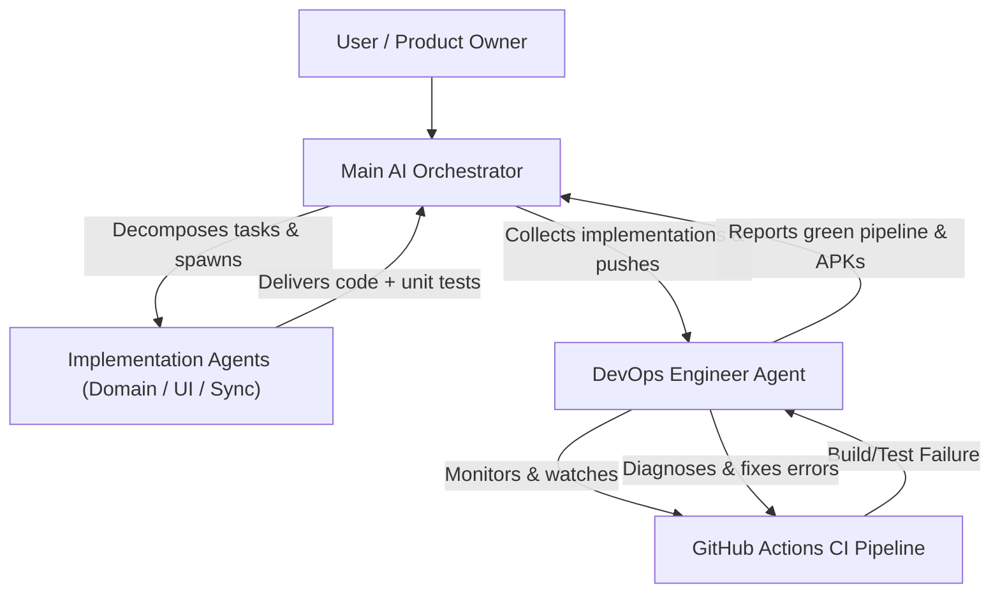

# LockerLift – AI Agent & Developer Guidelines (`AGENTS.md`)

This document serves as the authoritative handbook and progress tracking log for developers and AI assistants (e.g., Antigravity, Claude, Copilot) working on **LockerLift**. It defines guidelines, architectural mandates, testing requirements, and current implementation progress.

---

## 1. Vision & Core Philosophy of LockerLift

LockerLift is a **privacy-first, local, open-source strength training tracker** for Android and Wear OS.

### The Locker Scenario
> The smartphone remains in the locker during the entire workout. The Wear OS smartwatch operates completely autonomously without wireless connectivity (no Bluetooth, no Wi-Fi).

**Consequences for Every Code Contribution:**
* **Never** assume that a connection to the phone or internet exists during a workout on the watch.
* All CRUD actions must complete locally on the watch with zero latency and zero errors.
* Data transmission occurs strictly asynchronously following the **Store-and-Forward** principle.

---

## 2. Multi-Agent Orchestration & Workflow Model

LockerLift development is executed via an **autonomous multi-agent hierarchy**:



### 2.1 Agent Roles & Responsibilities

1. **Main AI Orchestrator:**
   * Acts as the primary interface to the user and overall project architect.
   * Analyzes user requests, maintains architectural invariants, and decomposes goals into modular implementation tasks.
   * Spawns specialized **Implementation Agents** as needed across modules (`:core:*`, `:mobile`, `:wear`).
   * Collects and integrates deliverables from all implementation agents once their work is completed.
2. **Implementation Agents:**
   * Autonomous subagents assigned to specific domain logic, screens, DAOs, or sync features.
   * Adhere strictly to the unit testing mandate: write tests concurrently with code (`AAA` pattern).
   * Report diffs, files created/modified, and test outcomes back to the Main AI Orchestrator.
3. **DevOps Engineer Agent:**
   * Spawned by the Main AI Orchestrator after implementations are consolidated and pushed to the repository.
   * Monitors and watches GitHub Actions CI/CD workflows (`gh run list`, `gh run watch`).
   * Inspects runner logs, diagnoses build, compilation, classpath, or test failures on GitHub, and fixes them autonomously.
   * Ensures the entire CI pipeline turns green and downloadable APK artifacts are produced.

---

## 3. Strict Unit Testing Mandate

> [!IMPORTANT]
> **Unit tests are mandatory for every implementation:**
> 1. **100% Test Coverage for Logic:** Every new function, business logic, calculation (e.g., Double Progression, cadence), data model, mapping, conversion, serialization, and DAO workflow **MUST** be covered by automated unit tests.
> 2. **Existing Tests Must Always Pass:** All existing unit tests must run cleanly without regressions when making future changes or additions.
> 3. **Rule on Modifying Tests:** A unit test may **only** be modified or deleted if the specifically tested feature was intentionally removed or superseded by a new specification.
> 4. **Future-Proofing:** Future implementations must actively leverage and expand existing test suites. Before finishing any task, verify that all tests for the module are green.

---

## 4. Implementation Progress & Tracking

> [!NOTE]
> **Mandatory for every agent:** Whenever new features are implemented, adjusted, or extended, this section in `AGENTS.md` **MUST** be updated immediately. Document:
> * Which feature / user story was implemented.
> * Which files were created or modified.
> * Which unit tests were added.

### Current Implementation Status

#### Status Overview

- [x] **Project Setup & Multi-Module Architecture**
  - Root Gradle Configuration: `settings.gradle.kts`, `build.gradle.kts`, `gradle.properties`, `gradle/libs.versions.toml`, `.gitignore`.
  - Module Structure: `:core:model`, `:core:database`, `:core:sync`, `:core:healthconnect`, `:mobile`, `:wear`.
- [x] **Documentation & Issue Tracking**
  - `README.md` (Project overview, tech stack, and user guides index)
  - `documentation/` (Official user documentation portal: getting started, locker scenario guide, wear OS tracking guide, mobile app guide, FAQ & troubleshooting)
  - GitHub Issues #1–#15 (Epics 1–6 with all acceptance criteria, transferred from specification)
  - `ARCHITECTURE.md` (System design, ERD, Wearable Data Layer protocols, Health Connect)
  - `AGENTS.md` (Developer & agent guidelines with multi-agent orchestration, testing mandate & changelog)
- [x] **Internationalization (i18n)**
  - English (default) and German (`values-de/`) language support across `:mobile` and `:wear`.
  - All user-facing strings migrated to `res/values/strings.xml` and `res/values-de/strings.xml`.
  - Project documentation standardized in English.
- [x] **Epic 1 & 2: Data Foundations & Models (`:core:model`, `:core:database`)**
  - Domain classes: `Machine`, `WorkoutTemplate`, `TemplateMachineCrossRef`, `WorkoutSession`, `SessionMachineInstance`, `WorkoutSet`, `SyncQueueItem`, `SetType`, `SyncStatus`, `QueueStatus`.
  - Room Entities with Cascade Delete, indices, and mappers (`MachineEntity`, `WorkoutTemplateEntity`, `TemplateMachineCrossRefEntity`, `WorkoutSessionEntity`, `SessionMachineInstanceEntity`, `WorkoutSetEntity`, `SyncQueueEntity`).
  - DAOs: `MachineDao`, `WorkoutTemplateDao`, `WorkoutSessionDao`, `SyncQueueDao`.
  - Relations: `WorkoutTemplateWithMachines`, `WorkoutSessionWithDetails`.
  - `Converters` for Room enums and `LockerLiftDatabase` builder.
- [x] **Epic 5: Wearable Data Layer Synchronization (`:core:sync`)**
  - `SyncConstants` (Paths for DataClient, ChannelClient, MessageClient).
  - DTOs: `WorkoutSessionPayload`, `SessionMachineInstancePayload`.
  - `SyncPayloadSerializer` (Kotlinx Serialization JSON with type safety).
  - `WearableDataLayerManager` (Streaming via `ChannelClient`, Master Data via `DataClient`, ACK via `MessageClient`).
  - `SyncQueueWorker` (WorkManager task for background transfer upon reconnect).
- [x] **Epic 6: Health Connect Integration (`:core:healthconnect`)**
  - `HealthConnectManager` with SDK status & permission checking (`WRITE_EXERCISE`, etc.).
  - `ExerciseRecordBuilder` (`EXERCISE_TYPE_STRENGTH_TRAINING`).
- [x] **Epic 1, 2 & 4: Mobile App (`:mobile`)**
  - `MainActivity` with bottom navigation and localized tabs.
  - `CatalogScreen` (Machine catalog management, duplicate name validation, localized strings).
  - `TemplateListScreen` ($n$-templates management, cold-start templates, localized strings).
  - `HistoryScreen` (Past sessions, set breakdown, localized strings).
  - `MobileDataLayerListenerService` (Reception via `ChannelClient`, Room insert, Health Connect trigger & ACK).
- [x] **Epic 3 & 4: Standalone Wear OS Tracking (`:wear`)**
  - `WorkoutForegroundService` with Ongoing Activity notification & WakeLock.
  - `MainActivity` with template selection & free workout (localized strings).
  - `ActiveWorkoutScreen` (Exercise list, ad-hoc station addition, skip, template consolidation, queue persistence, localized strings).
  - `RepsWeightInputScreen` (Rotary input support, quick buttons, double progression highlight, localized strings).
  - `RestTimerScreen` (Rest timer with haptic vibration, localized strings).
  - `WearDataLayerListenerService` (Master data sync and ACK handling).
- [x] **Unit Testing Suite (`:core:model`, `:core:sync`, `:core:database`)**
  - `DomainModelTest.kt`: Tests for instantiation, UUIDs, defaults, and JSON serialization.
  - `SyncPayloadSerializerTest.kt`: Tests for lossless encoding/decoding of complex workout payloads.
  - `EntityMappingTest.kt`: Tests for bidirectional mappings between domain models and Room entities as well as type converters.
- [x] **Agent Skills (`.agents/skills/`)**
  - `git-commit-guidelines`: Skill enforcing Conventional Commits, scope validation, and mandatory test inclusion.
  - `unit-testing-guidelines`: Guide for automated unit tests (AAA pattern, mappers, serializers, Room, invariants).
  - `feature-implementation-workflow`: End-to-end workflow for implementing new features and user stories.
  - `release-versioning-rules`: Rules and criteria for SemVer release bumps (Major vs. Minor vs. Patch) and Gradle version bumps.
  - `internationalization-guide`: Standards and procedures for adding new language locales and managing strings across mobile and wear.
  - `user-documentation-guide`: Guidelines and standards for writing structured, accessible, and user-centric documentation.
- [x] **CI/CD Pipeline (`.github/workflows/build-and-test.yml`)**
  - Automated GitHub Actions pipeline with `test` stage (unit tests) and `build-apks` stage (debug APKs for Mobile & Wear OS ready for download).

---

## 5. Immutable Architectural Invariants

1. **UUIDs as Primary Keys:**
   * Always use `java.util.UUID.randomUUID().toString()` as the primary key for all entities.
   * **Never** use `autoGenerate = true` on Room IDs! Distributed offline databases require collision-free keys.
2. **Decoupling of Template and Session:**
   * A `WorkoutSession` copies template machines into `SessionMachineInstance` records.
   * Modifying, adding, or skipping machines during a workout does **not** automatically alter the underlying template.
   * Only upon workout completion is the user explicitly prompted whether variations should be consolidated back into the template.
3. **Data Layer API Channel Separation:**
   * **`DataClient`**: For master data (machines, templates).
   * **`ChannelClient`**: For complete workout sessions (JSON payload via byte stream).
   * **`MessageClient`**: For acknowledgment packets (ACK) and control messages.
4. **Health Connect Belongs Strictly on the Smartphone:**
   * The Wear OS app does **not** write directly to Health Connect.
   * The Wear OS app streams aggregated workout sessions to the phone via sync, which then persists the `ExerciseSessionRecord` into Health Connect.
5. **Foreground Service for Wear OS Tracking:**
   * An active workout on the watch must run inside an Android `Foreground Service` registering an `Ongoing Activity` notification. This prevents the OS from killing the process during ambient mode or memory pressure.

---

## 6. Module Structure & Package Organization

Root package: `com.lockerlift`

| Module | Gradle Path | Purpose | Allowed Dependencies |
|---|---|---|---|
| Domain Models | `:core:model` | Pure Kotlin classes, enums, value objects | **No** Android framework libraries |
| Database | `:core:database` | Room DB, entities, DAOs, SQLCipher | `:core:model`, Room, Coroutines |
| Synchronization | `:core:sync` | Wearable Data Layer Manager, serialization | `:core:model`, `:core:database`, Play Services Wearable |
| Health Connect | `:core:healthconnect` | Health Connect client, record builder | `:core:model`, AndroidX Health Connect |
| Mobile App | `:mobile` | Smartphone Compose UI, tracking, listener service | All `:core:*` modules |
| Wear OS App | `:wear` | Compose for Wear OS, Horologist, Rotary, service | `:core:model`, `:core:database`, `:core:sync` |

> [!IMPORTANT]
> Strictly respect module boundaries! `:core:model` must never contain Android imports. `:wear` must never reference `:core:healthconnect`.

---

## 7. Code Conventions & Best Practices

### 7.1 Kotlin & Coroutines
* **Null Safety:** Prefer non-nullable types. Avoid `!!` without exception.
* **Coroutines Dispatcher:**
  * UI / ViewModels: `viewModelScope.launch` on `Dispatchers.Main`.
  * Database & IO: All DAO functions are `suspend` or return `Flow<T>`. Room automatically switches to a background dispatcher.
  * Heavy Computation / Parsing: `withContext(Dispatchers.Default)`.
* **State Management:**
  * ViewModels expose `StateFlow<UiState>` via `asStateFlow()`.
  * One-off events (navigation, snackbars, haptics) are handled via `SharedFlow` or `Channel`.

### 7.2 Jetpack Compose & Wear OS Compose
* **State Hoisting:** UI components are stateless whenever possible.
* **Wear OS Horologist:**
  * Use Horologist `ScalingLazyColumn` with appropriate content padding for round displays.
  * Support Rotary Input (rotatable bezel) for weight and rep adjustments.
* **Haptics:**
  * Use `LocalHapticFeedback.current` for clicks on rotary steps and completion of sets or rest timer expiration.

### 7.3 Room Database
* All foreign keys define explicit cascade delete behavior (`onDelete = ForeignKey.CASCADE` for child elements such as sets).
* Create indices for all foreign keys and frequently queried columns (e.g., `machine_id`, `session_id`).
* Complex write operations (e.g., workout completion, sync import) must be encapsulated in `@Transaction` methods.

---

## 8. Git & Commit Guidelines (Commit Message Guidelines)

All commits must adhere to the **Conventional Commits** standard (v1.0.0). This ensures a clean project history, automatic changelog generation, and full traceability.

### Format
```text
<type>(<scope>): <short imperative summary>

[Optional detailed body: context, motivation, architectural decisions, what changed and why]

[Optional footer: references to user stories or issue tracking, e.g. 'Closes US-3.1']
```

### 8.1 Allowed Types (`type`)
* `feat`: New user feature (e.g., new screen, progression logic).
* `fix`: Bugfix or correction of unexpected behavior.
* `test`: Adding, updating, or fixing unit tests.
* `docs`: Documentation changes only (`README.md`, `AGENTS.md`, etc.).
* `refactor`: Code restructuring without adding functionality or fixing bugs.
* `chore`: Build configuration, Gradle updates, version bumps, `.gitignore`.
* `perf`: Performance optimizations.

### 8.2 Allowed Scopes (`scope`)
* `model`: Changes in `:core:model`
* `database`: Changes in `:core:database`
* `sync`: Changes in `:core:sync`
* `healthconnect`: Changes in `:core:healthconnect`
* `mobile`: Changes in `:mobile`
* `wear`: Changes in `:wear`
* `project`: Cross-cutting changes affecting multiple modules or root setup

### 8.3 Mandatory Commit Rules
1. **Imperative Mood / Present Tense:** Write `feat(wear): add rotary input support` instead of `added rotary input`.
2. **No Trailing Period:** The subject line must **never** end with a period.
3. **Subject Length:** Keep the first line strictly under 72 characters.
4. **Atomic Commits:** Each commit must encapsulate a single logical change.
5. **Commit Tests with Features:** When introducing a new feature (`feat(...)`), the corresponding unit tests **MUST** be included in the exact same commit.
