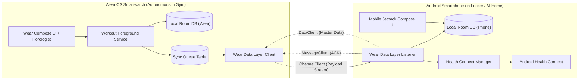
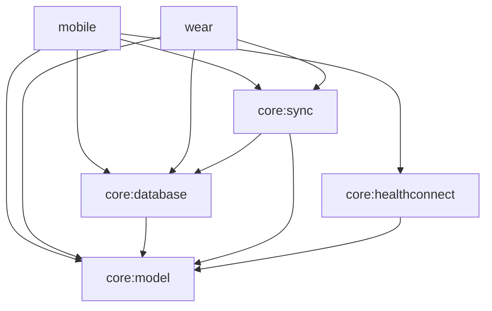
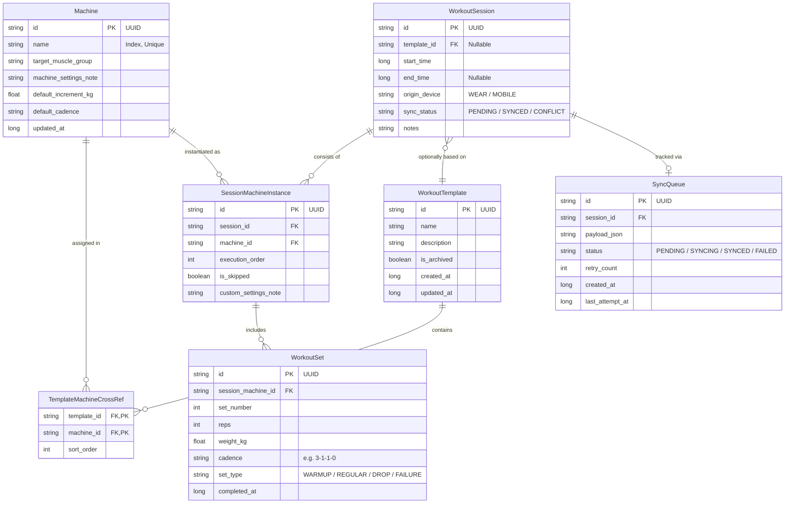
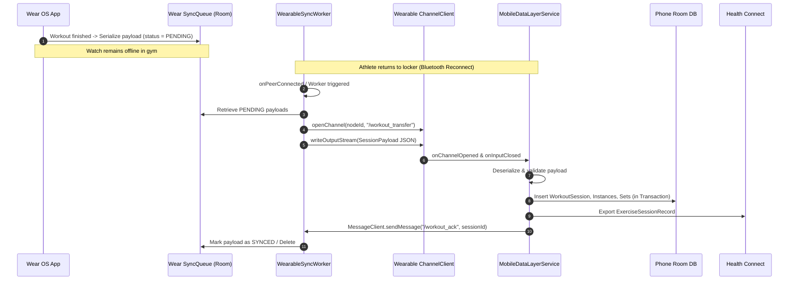

# LockerLift – Technical Architecture & System Design

This document specifies the architecture, data flows, interfaces, and database schemas of **LockerLift**, a local-first, modular, open-source strength training tracking solution for Android and Wear OS.

---

## 1. Core Principles & System Overview

### 1.1 The "Locker Scenario" (Locker Isolation)
The core premise of LockerLift is:
> *The smartphone stays in the gym locker during the workout (completely out of Bluetooth and Wi-Fi range). The Wear OS smartwatch operates 100% autonomously.*

This yields non-negotiable architectural mandates:
1. **Not a Thin Client:** The Wear OS app is a full-fledged application with its own local Room database, business logic, and UI.
2. **UUID Primary Keys:** All entities are instantiated with random UUIDs (UUIDv4) so records can be created decentrally on both watch and phone without risk of ID collisions.
3. **Store-and-Forward Replication:** All write operations on the smartwatch are recorded in a persistent synchronization queue (`SyncQueue`), processed asynchronously once connectivity to the phone is restored.



---

## 2. Multi-Module Structure

The project is structured as a modular Gradle monorepo:

```text
LockerLift/
├── core/
│   ├── model/              # Pure Kotlin data classes, enums, value objects (Zero-Dependency)
│   ├── database/           # Android Room entities, DAOs, TypeConverters, SQLCipher support
│   ├── sync/               # Data Layer API abstractions, payload serialization, sync logic
│   └── healthconnect/      # Health Connect client, record builder & permission handling
├── mobile/                 # Smartphone App (Application Plugin)
│   ├── ui/                 # Jetpack Compose screens (Catalog, Templates, History)
│   ├── tracking/           # Mobile tracking UI (if phone is used during workout)
│   └── service/            # WearableListenerService for incoming workout payloads
└── wear/                   # Wear OS App (Application Plugin)
    ├── presentation/       # Compose for Wear OS, Horologist, Rotary Input
    ├── tracking/           # Foreground service with Ongoing Activity notification
    └── communication/      # Sync-Queue worker & sender via ChannelClient
```

### 2.1 Module Dependency Graph



* **`core:model`**: Platform-independent Kotlin module without Android framework dependencies. Contains domain classes and enums.
* **`core:database`**: Manages tables, migrations, and indices. Included by both `mobile` and `wear`.
* **`core:sync`**: Encapsulates Google Play Services Wearable (`ChannelClient`, `DataClient`, `MessageClient`).
* **`core:healthconnect`**: Exclusive to the smartphone (Wear OS does not currently support writing strength training session records directly to Health Connect).

---

## 3. Data Model & Room Schema

### 3.1 Entity Relationship Diagram (ERD)



### 3.2 Schema Specifications

#### Machine (`machines`)
* `id` (`String` / UUID, Primary Key)
* `name` (`String`, Not Null, Unique Index to prevent local duplicates)
* `targetMuscleGroup` (`String`, Not Null)
* `machineSettingsNote` (`String?`, Nullable, e.g., "Seat height 4, lever arm level 2")
* `defaultIncrementKg` (`Float`, Default `2.5f`)
* `defaultCadence` (`String?`, e.g., "3-1-1-0")
* `updatedAt` (`Long`, Unix timestamp in ms)

#### WorkoutTemplate (`workout_templates`)
* `id` (`String` / UUID, Primary Key)
* `name` (`String`, Not Null)
* `description` (`String?`)
* `isArchived` (`Boolean`, Default `false`)
* `createdAt` (`Long`)
* `updatedAt` (`Long`)

#### TemplateMachineCrossRef (`template_machine_cross_ref`)
* Composite Primary Key: `(templateId, machineId)`
* Foreign Keys with Cascade Delete on Template
* `sortOrder` (`Int`, order within the template)

#### WorkoutSession (`workout_sessions`)
* `id` (`String` / UUID, Primary Key)
* `templateId` (`String?`, Nullable)
* `startTime` (`Long`, Not Null)
* `endTime` (`Long?`)
* `originDevice` (`String`: `WEAR_OS` or `MOBILE`)
* `syncStatus` (`SyncStatus`: `LOCAL_ONLY`, `PENDING_SYNC`, `SYNCED`)
* `notes` (`String?`)

#### SessionMachineInstance (`session_machine_instances`)
* `id` (`String` / UUID, Primary Key)
* `sessionId` (`String`, Foreign Key referencing `WorkoutSession.id`, Cascade Delete)
* `machineId` (`String`, Foreign Key referencing `Machine.id`)
* `executionOrder` (`Int`)
* `isSkipped` (`Boolean`, Default `false`)
* `customSettingsNote` (`String?`)

#### WorkoutSet (`workout_sets`)
* `id` (`String` / UUID, Primary Key)
* `sessionMachineId` (`String`, Foreign Key referencing `SessionMachineInstance.id`, Cascade Delete)
* `setNumber` (`Int`)
* `reps` (`Int`)
* `weightKg` (`Float`)
* `cadence` (`String?`, Format: `Eccentric-PauseBottom-Concentric-PauseTop`)
* `setType` (`SetType`: `WARMUP`, `NORMAL`, `DROPSET`, `MYOREPS`, `FAILURE`)
* `completedAt` (`Long`)

#### SyncQueue (`sync_queue`)
* `id` (`String` / UUID, Primary Key)
* `sessionId` (`String`)
* `payloadJson` (`String`)
* `status` (`QueueStatus`: `PENDING`, `IN_TRANSIT`, `ACKNOWLEDGED`, `ERROR`)
* `retryCount` (`Int`)
* `createdAt` (`Long`)
* `lastAttemptAt` (`Long`)

---

## 4. Synchronization Protocol (Wearable Data Layer)

### 4.1 Channel Differentiation
Google Play Services Wearable provides three core components:
1. **`DataClient` (DataItem API):**
   * Automatically replicated key-value storage.
   * Used for **master data** (machine catalog and workout templates) because they are relatively compact and synchronized automatically by the OS once both devices connect.
2. **`ChannelClient` (Streaming API):**
   * Bidirectional byte stream for large, atomic data transfers.
   * Used for **completed workout sessions** (session payload containing all sets, machine instances, and notes).
3. **`MessageClient` (RPC / Instant Messaging):**
   * Low latency, no local caching.
   * Used for **acknowledgments (ACKs)** and remote control commands.

### 4.2 Sync Flow: Workout from Wear OS to Phone



### 4.3 Conflict Resolution Strategy (Master-Slave Roles)
* **Machine Catalog & Templates:** The smartphone is the **Single Source of Truth (Master)**. Changes originating on the watch (e.g., ad-hoc machine creation) are sent as inserts; on naming collisions, the smartphone ID prevails.
* **Workouts & Sets:** The smartwatch is the **Single Source of Truth (Master)** for workouts conducted on the watch. Completed sessions are treated as immutable history records on the smartphone.

---

## 5. Wear OS Architecture & Specialized Design

### 5.1 Ongoing Activity Foreground Service
To ensure Android does not terminate tracking during screen dimming (Ambient Mode) or memory pressure:
* A `WorkoutForegroundService` holds a partial WakeLock and registers an `OngoingActivityStatus` notification.
* The UI leverages Horologist and Compose for Wear OS with `ScalingLazyColumn` and Rotary Input support.

### 5.2 Rotary Input (Rotatable Bezel)
* Adjusting sets and reps supports rotary dial scrolling (`Modifier.rotaryScrollable`).
* Swift adjustments: steps follow the machine's `defaultIncrementKg` (e.g., 2.5 kg increments per detent).

### 5.3 Cold-Start & In-Session Modification
* Starting an empty workout enables ad-hoc addition of machines on the fly.
* Upon workout completion, the system compares executed exercises with the template:
  * If differences exist, prompt the user for template consolidation.
  * Upon confirmation, the template is updated or duplicated.

---

## 6. Health Connect Integration

### 6.1 Record Mapping
* **Session:** `ExerciseSessionRecord` with `exerciseType = ExerciseSessionRecord.EXERCISE_TYPE_STRENGTH_TRAINING`.
* **Metadata:** Template title or "Free Workout (LockerLift)".
* **Sensor Extras:** Aggregated heart rate telemetry recorded on the smartwatch is exported as a `HeartRateRecord`.

### 6.2 Permission Management
* Permissions are verified before write operations:
  * `HealthPermission.getWritePermission(ExerciseSessionRecord::class)`
  * `HealthPermission.getWritePermission(HeartRateRecord::class)`
  * `HealthPermission.getWritePermission(TotalCaloriesBurnedRecord::class)`
* Denied permissions do not crash the app, but are gracefully logged and skipped.
