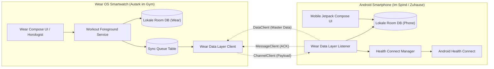
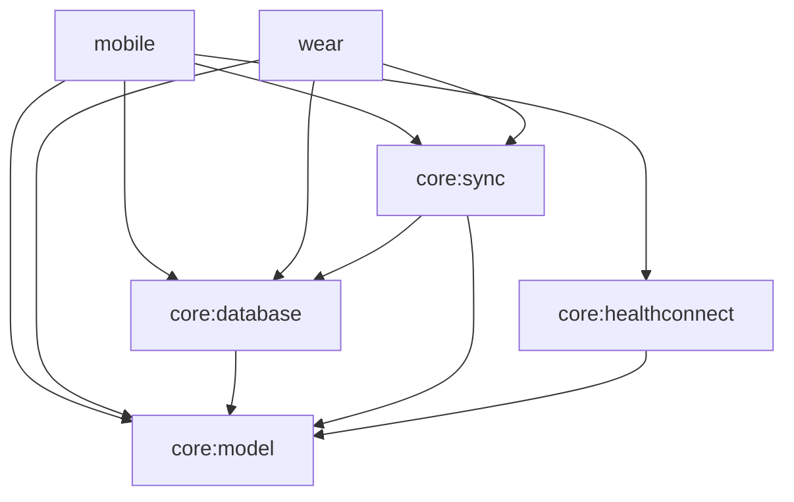
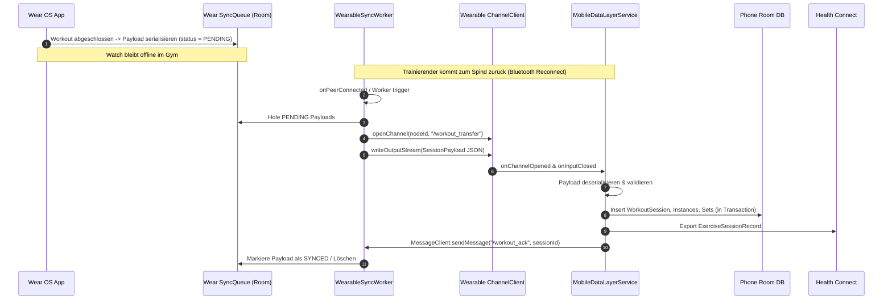

# LockerLift – Technische Architektur & Systemdesign

Dieses Dokument spezifiziert die Architektur, Datenflüsse, Schnittstellen und Datenbankschemata von **LockerLift**, einer lokalen, modularen Open-Source-Lösung für Kraftsport-Tracking auf Android und Wear OS.

---

## 1. Leitprinzipien & Systemübersicht

### 1.1 Das „Spind-Szenario“ (Locker Isolation)
Die Kernannahme von LockerLift lautet:
> *Das Smartphone liegt während des Trainings im Spind (außerhalb jeglicher Bluetooth- oder WLAN-Reichweite). Die Wear OS Smartwatch operiert 100 % autark.*

Daraus ergeben sich zwingende Architekturvorgaben:
1. **Kein Thin-Client:** Die Wear OS App ist eine vollwertige App mit eigener Room-Datenbank, Geschäftslogik und UI.
2. **UUID-Primärschlüssel:** Alle Entitäten werden mit Zufalls-UUIDs (UUIDv4) instanziiert, damit dezentral auf Uhr und Smartphone Datensätze erzeugt werden können, ohne ID-Kollisionen zu riskieren.
3. **Store-and-Forward Replikation:** Alle Schreiboperationen auf der Smartwatch wandern in eine persistente Synchronisations-Warteschlange (`SyncQueue`), die asynchron abgearbeitet wird, sobald die Verbindung zum Smartphone wiederhergestellt ist.



---

## 2. Multi-Module Struktur

Das Projekt ist als modularer Gradle-Monorepo aufgebaut:

```text
LockerLift/
├── core/
│   ├── model/              # Reine Kotlin Data Classes, Enums, Value Objects (Zero-Dependency)
│   ├── database/           # Android Room Entities, DAOs, TypeConverters, SQLCipher Support
│   ├── sync/               # Data Layer API Abstraktionen, Payload-Serialisierung, Sync-Logik
│   └── healthconnect/      # Health Connect Client, Record Builder & Berechtigungs-Handling
├── mobile/                 # Smartphone App (Application Plugin)
│   ├── ui/                 # Jetpack Compose Screens (Katalog, Vorlagen, Historie)
│   ├── tracking/           # Mobile Tracking UI (falls Handy doch genutzt wird)
│   └── service/            # WearableListenerService für eingehende Workout-Payloads
└── wear/                   # Wear OS App (Application Plugin)
    ├── presentation/       # Compose for Wear OS, Horologist, Rotary Input
    ├── tracking/           # Foreground Service mit Ongoing Activity Notification
    └── communication/      # Sync-Queue Worker & Sender via ChannelClient
```

### 2.1 Modul-Abhängigkeitsgraph



* **`core:model`**: Plattformunabhängiges Kotlin-Modul ohne Android-Framework-Abhängigkeiten. Beinhaltet Domain-Klassen und Enums.
* **`core:database`**: Verwaltet Tabellen, Migrationen und Indizes. Wird sowohl von `mobile` als auch von `wear` eingebunden.
* **`core:sync`**: Kapselt Google Play Services Wearable (`ChannelClient`, `DataClient`, `MessageClient`).
* **`core:healthconnect`**: Exklusiv für Smartphone relevant (Wear OS unterstützt aktuell kein direktes lokales Health Connect Schreiben von Krafttraining-Sessions).

---

## 3. Datenmodell & Room Schema

### 3.1 Entity Relationship Diagram (ERD)


### 3.2 Schema-Spezifikationen

#### Machine (`machines`)
* `id` (`String` / UUID, Primary Key)
* `name` (`String`, Not Null, Unique Index zur Vermeidung lokaler Duplikate)
* `targetMuscleGroup` (`String`, Not Null)
* `machineSettingsNote` (`String?`, Nullable, z. B. „Sitzhöhe 4, Hebelarm Stufe 2“)
* `defaultIncrementKg` (`Float`, Default 2.5f)
* `defaultCadence` (`String?`, z. B. „3-1-1-0“)
* `updatedAt` (`Long`, Unix-Timestamp in ms)

#### WorkoutTemplate (`workout_templates`)
* `id` (`String` / UUID, Primary Key)
* `name` (`String`, Not Null)
* `description` (`String?`)
* `isArchived` (`Boolean`, Default `false`)
* `createdAt` (`Long`)
* `updatedAt` (`Long`)

#### TemplateMachineCrossRef (`template_machine_cross_ref`)
* Composite Primary Key: `(templateId, machineId)`
* Foreign Keys mit Cascade Delete auf Template
* `sortOrder` (`Int`, Reihenfolge innerhalb des Templates)

#### WorkoutSession (`workout_sessions`)
* `id` (`String` / UUID, Primary Key)
* `templateId` (`String?`, Nullable)
* `startTime` (`Long`, Not Null)
* `endTime` (`Long?`)
* `originDevice` (`String`: `WEAR_OS` oder `MOBILE`)
* `syncStatus` (`SyncStatus`: `LOCAL_ONLY`, `PENDING_SYNC`, `SYNCED`)
* `notes` (`String?`)

#### SessionMachineInstance (`session_machine_instances`)
* `id` (`String` / UUID, Primary Key)
* `sessionId` (`String`, Foreign Key auf `WorkoutSession.id`, Cascade Delete)
* `machineId` (`String`, Foreign Key auf `Machine.id`)
* `executionOrder` (`Int`)
* `isSkipped` (`Boolean`, Default `false`)
* `customSettingsNote` (`String?`)

#### WorkoutSet (`workout_sets`)
* `id` (`String` / UUID, Primary Key)
* `sessionMachineId` (`String`, Foreign Key auf `SessionMachineInstance.id`, Cascade Delete)
* `setNumber` (`Int`)
* `reps` (`Int`)
* `weightKg` (`Float`)
* `cadence` (`String?`, Format: `Exzentrik-PauseUnten-Konzentrik-PauseOben`)
* `setType` (`SetType`: `WARMUP`, `NORMAL`, `DROPSET`, `MYOREPS`, `FAILURE`)
* `completedAt` (`Long`)

#### SyncQueue (`sync_queue`)
* `id` (`String` / UUID, Primary Key)
* `sessionId` (`String`)
* `payloadJson` (`String`)
* `status` (`QueueStatus`: `PENDING`, `IN_TRANSIT`, `ACKNOWLEDGED`, `ERROR`)
* `retryCount` (`Int`)
* `createdAt` (`Long`)
* `lastAttemptAt` (`Long`)

---

## 4. Synchronisationsprotokoll (Wearable Data Layer)

### 4.1 Kanal-Differenzierung
Google Play Services Wearable bietet drei Kernkomponenten:
1. **`DataClient` (DataItem API):**
   * Automatisch replizierter Key-Value Speicher.
   * Verwendung für **Stammdaten** (Maschinenkatalog und Vorlagen), da diese relativ klein sind und vom System automatisch synchronisiert werden, sobald beide Geräte im Funknetz sind.
2. **`ChannelClient` (Streaming API):**
   * Bidirektionaler Byte-Stream für größere, atomare Datentransfers.
   * Verwendung für **abgeschlossene Workouts** (Session-Payload inklusive aller Sätze und Übungen).
3. **`MessageClient` (RPC / Instant Messaging):**
   * Geringe Latenz, keine lokale Zwischenspeicherung.
   * Verwendung für **Quittungen (ACKs)** und Fernsteuerungs-Kommandos.

### 4.2 Sync-Ablauf: Workout von Wear OS zu Phone



### 4.3 Konfliktlösungsstrategie (Master-Slave-Rollen)
* **Maschinenkatalog & Templates:** Smartphone ist **Single Source of Truth (Master)**. Änderungen auf der Uhr (z. B. Ad-hoc Erstellung einer neuen Maschine) werden als Insert übertragen; bei Namenskollisionen gewinnt die Smartphone-ID.
* **Workouts & Sätze:** Smartwatch ist **Single Source of Truth (Master)** für Workouts, die auf der Smartwatch ausgeführt wurden. Ein abgeschlossenes Workout wird auf dem Smartphone als immutable History Record behandelt.

---

## 5. Wear OS Architektur & Besonderheiten

### 5.1 Ongoing Activity Foreground Service
Um zu verhindern, dass Android das Tracking bei Display-Abschaltung (Ambient Mode) oder Speicherdruck beendet:
* Ein `WorkoutForegroundService` hält ein Wakelock und bindet eine `OngoingActivityStatus`-Notification ein.
* Die UI nutzt Horologist und Compose for Wear OS mit `ScalingLazyColumn` und Rotary Input Unterstützung.

### 5.2 Rotary Input (Drehbare Lünette)
* Die Eingabe von Sätzen und Wiederholungen unterstützt das Scrollen mit der Lünette (`Modifier.rotaryScrollable`).
* Schnelle Schritte: Inkremente entsprechend `defaultIncrementKg` der Maschine (z. B. 2,5 kg Schritte pro Raste).

### 5.3 Cold-Start & In-Session Modifikation
* Wird ein leeres Training gestartet, können Maschinen direkt hinzugefügt werden.
* Beim Beenden vergleicht das System die ausgeführten Maschinen mit dem Template:
  * Falls Differenzen bestehen: Anzeige des Dialogs `TemplateKonsolidierungDialog`.
  * Bei Zustimmung wird eine Kopie bzw. ein Update des Templates generiert.

---

## 6. Health Connect Integration

### 6.1 Record-Mapping
* **Session:** `ExerciseSessionRecord` mit `exerciseType = ExerciseSessionRecord.EXERCISE_TYPE_STRENGTH_TRAINING`.
* **Metadaten:** Titel des Templates oder „Freies Training (LockerLift)“.
* **Sensor-Zusatzdaten:** Falls die Smartwatch während des Workouts Herzfrequenz erfasst hat, werden diese aggregiert als `HeartRateRecord` übergeben.

### 6.2 Permission Management
* Berechtigungen werden vor dem Schreibzugriff abgefragt:
  * `HealthPermission.getWritePermission(ExerciseSessionRecord::class)`
  * `HealthPermission.getWritePermission(HeartRateRecord::class)`
  * `HealthPermission.getWritePermission(TotalCaloriesBurnedRecord::class)`
* Verweigerte Berechtigungen führen nicht zu App-Abstürzen, sondern werden im Log vermerkt.
