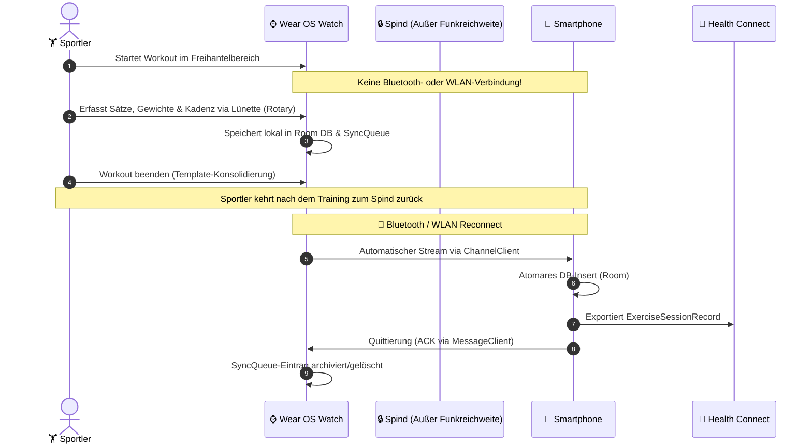
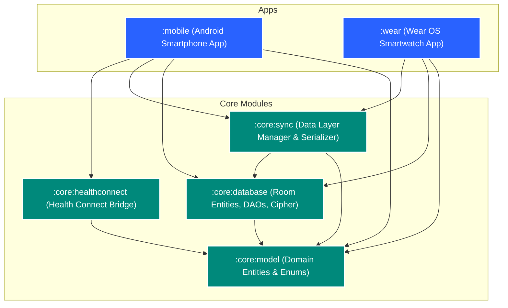

<div align="center">

# 🏋️‍♂️ LockerLift

### **Local-First, Open-Source Gym Tracker für Android & Wear OS**
*Das Smartphone bleibt im Spind – volle Autonomie auf deiner Smartwatch.*

[](https://kotlinlang.org)
[](https://developer.android.com)
[](https://developer.android.com/wear)
[](https://developer.android.com/jetpack/compose)
[](https://developer.android.com/health-and-fitness/guides/health-connect)
[](https://developer.android.com/training/data-storage/room)

---

[📖 Dokumentation](#-dokumentation--ressourcen) •
[🎯 Das Spind-Szenario](#-das-spind-szenario-locker-isolation) •
[✨ Kernfunktionen](#-kernfunktionen) •
[🏗️ Architektur & Module](#-systemarchitektur--modulaufbau) •
[🔄 Sync-Protokoll](#-synchronisations-protokoll-wearable-data-layer) •
[🧪 Testing & Qualität](#-unit-testing--qualitätsgarantie) •
[🛠️ Setup & Build](#-getting-started--build)

---

</div>

## 🎯 Das Spind-Szenario (Locker Isolation)

> **Die Kernphilosophie:**  
> Viele Kraftsportler lassen ihr Smartphone bewusst im Umkleidespind – um Ablenkungen zu vermeiden, Diebstahl vorzubeugen oder weil sperrige Smartphones bei Übungen stören.  
> **LockerLift ist exakt für dieses Szenario gebaut.**



* **Kein Thin-Client:** Die Smartwatch-App ist eine vollständige, autarke Applikation mit lokaler Room-Datenbank.
* **Keine Cloud-Pflicht:** Deine Trainingsdaten gehören dir. Sie verbleiben verschlüsselt und lokal auf deinen Geräten.
* **Store-and-Forward Synchronisation:** Datensätze werden lokal gequeued und erst übertragen, wenn du nach dem Workout wieder am Spind bist.

---

## ✨ Kernfunktionen

### 📱 Smartphone App (`:mobile`)
* 📋 **Globaler Maschinen- & Übungskatalog:** Maschinen mit Zielmuskelgruppe, individueller Schrittweite (z. B. 2,5 kg) und Notizen für Geräteeinstellungen (z. B. *„Sitzhöhe Stufe 4“*).
* 📑 **$n$-Vorlagenverwaltung:** Beliebig viele Trainingspläne (Push, Pull, Legs, etc.) – inklusive Cold-Start Vorlagen (initial leer anlegen und spontan befüllen).
* 📈 **Trainingshistorie:** Detaillierte Einsicht in vergangene Sessions mit Satz-für-Satz Aufschlüsselung.
* 🌉 **Health Connect Bridge:** Nahtlose Übergabe an Google Fit, Samsung Health und Drittanbieter.

### ⌚ Standalone Wear OS App (`:wear`)
* 🚀 **100% Autonomes Tracking:** Funktioniert komplett ohne Handyverbindung.
* ⚙️ **Rotary Input Support:** Blitzschnelle Eingabe von Gewicht und Wiederholungen über die drehbare Lünette oder Touch-Buttons.
* 🔄 **Cold-Start & Ad-Hoc Erweiterung:** Maschinen können mitten im Training spontan hinzugefügt, ausgetauscht oder übersprungen werden.
* 💡 **Template-Konsolidierung:** Wurde der Plan im Training variiert? Die App fragt beim Abschluss: *„Änderungen als Standard im Plan speichern?“*.
* ⏱️ **Pausentimer mit Haptik:** Automatischer Countdown nach jedem Satz mit diskreter Vibration beim Ablauf.
* 🛡️ **Ongoing Activity Foreground Service:** Verhindert, dass Wear OS das Workout im Ambient-Mode oder bei Speicherdruck beendet.
* 📊 **Progressive Overload Empfehlungen:** Anzeige des letzten Leistungsstands an der Station und visuelle Vorschläge zur Gewichtssteigerung (z. B. Double Progression).

---

## 🏗️ Systemarchitektur & Modulaufbau

LockerLift setzt auf ein hochgradig modulares Monorepo mit strikter Trennung von Verantwortlichkeiten:



### Modul-Matrix

| Modul | Typ | Zweck & Enthaltene Komponenten |
|---|---|---|
| [`:core:model`](file:///C:/Users/Chris/code/LockerLift/core/model) | Pure Kotlin | Plattformunabhängige Domain Models (`Machine`, `WorkoutSession`, `WorkoutSet`, Enums). Keine Android-Abhängigkeiten. |
| [`:core:database`](file:///C:/Users/Chris/code/LockerLift/core/database) | Android Library | Room Database, SQLite TypeConverters, DAOs (`MachineDao`, `WorkoutSessionDao`), Relationen & Cipher-Support. |
| [`:core:sync`](file:///C:/Users/Chris/code/LockerLift/core/sync) | Android Library | Google Play Services Wearable API Kapselung (`DataClient`, `ChannelClient`, `MessageClient`), JSON-Serializer, WorkManager Queue-Worker. |
| [`:core:healthconnect`](file:///C:/Users/Chris/code/LockerLift/core/healthconnect) | Android Library | AndroidX Health Connect Client, Permission Controller, Record Builder für `EXERCISE_TYPE_STRENGTH_TRAINING`. |
| [`:mobile`](file:///C:/Users/Chris/code/LockerLift/mobile) | Android App | Smartphone UI (Jetpack Compose Material 3), Katalog-, Vorlagen- und Historienverwaltung, Background Sync Listener. |
| [`:wear`](file:///C:/Users/Chris/code/LockerLift/wear) | Wear OS App | Wear OS UI (Horologist & Wear Compose), Rotary Input Steuerung, Workout Foreground Service, Rest Timer mit Vibration. |

---

## 🗄️ Datenbankschema & Entitäten

Alle Entitäten nutzen **UUIDv4 (`String`) als Primärschlüssel**, um dezentral auf Uhr und Smartphone Datensätze kollisionsfrei erzeugen zu können.


---

## 🔄 Synchronisations-Protokoll (Wearable Data Layer)

LockerLift trennt bewusst die Kanäle der Wearable Data Layer API:

<details>
<summary><b>1. Stammdaten (Maschinen & Vorlagen) ➔ <code>DataClient</code></b></summary>

* **Pfad:** `/equipment_catalog`, `/workout_templates`
* **Mechanik:** Automatisch replizierter Key-Value-Speicher (DataItem API).
* **Konfliktregel:** Smartphone ist **Master (Single Source of Truth)**. Auf dem Smartphone gepflegte Maschinen und Pläne werden automatisch auf gekoppelte Uhren gespiegelt.
</details>

<details>
<summary><b>2. Workout Sessions (Historie & Sätze) ➔ <code>ChannelClient</code></b></summary>

* **Pfad:** `/workout_payload_transfer`
* **Mechanik:** Bidirektionaler Byte-Stream für atomare Datentransfers großer JSON-Payloads inklusive aller Sätze, Notizen und Zeiten.
* **Konfliktregel:** Smartwatch ist **Master** für Einheiten, die auf der Smartwatch ausgeführt wurden.
</details>

<details>
<summary><b>3. Quittierung & RPC ➔ <code>MessageClient</code></b></summary>

* **Pfad:** `/workout_ack`, `/sync_ping`
* **Mechanik:** Schnelle, unbestätigte Nachrichten mit geringer Latenz zur Übermittlung von Bestätigungs-IDs (Zwei-Wege-Handshake). Nach Empfang des ACKs wird die Session in der Queue der Uhr bereinigt.
</details>

---

## 🧪 Unit Testing & Qualitätsgarantie

> [!IMPORTANT]
> In LockerLift gilt ein **strenges Unit-Testing-Mandat**. Alle mathematischen Logiken, Progressionen, Enums, Converter, Mappings und Serialisierungen sind zu 100 % mit Unit-Tests abgedeckt.
> 
> **Regressionstest-Garantie:** Alle Tests müssen bei künftigen Änderungen fehlerfrei durchlaufen. Ein Test darf nur modifiziert oder gelöscht werden, wenn das Feature bewusst aus der Spezifikation entfernt wurde.

### Enthaltene Unit-Test-Suites:
* [`DomainModelTest.kt`](file:///C:/Users/Chris/code/LockerLift/core/model/src/test/kotlin/com/lockerlift/core/model/DomainModelTest.kt): Validierung von Instanziierung, UUID-Kollisionsfreiheit, Standardwerten und JSON-Serialisierung.
* [`SyncPayloadSerializerTest.kt`](file:///C:/Users/Chris/code/LockerLift/core/sync/src/test/kotlin/com/lockerlift/core/sync/SyncPayloadSerializerTest.kt): Verlustfreier Roundtrip komplexer Workout-Payload-Graphen.
* [`EntityMappingTest.kt`](file:///C:/Users/Chris/code/LockerLift/core/database/src/test/kotlin/com/lockerlift/core/database/EntityMappingTest.kt): Bidirektionale Mappings zwischen Domain Models und Room Entities sowie Validierung aller TypeConverter.

---

## 🤖 AI Agent & Developer Skills

Das Repository stattet Coding-Assistenten (und Entwickler) mit vordefinierten Skills im Ordner `.agents/skills/` aus:

* 🧭 [**`git-commit-guidelines`**](file:///C:/Users/Chris/code/LockerLift/.agents/skills/git-commit-guidelines/SKILL.md): Verbindliche Formatvorgaben nach Conventional Commits (v1.0.0), Scopes und Test-Commit-Pflicht.
* 🧪 [**`unit-testing-guidelines`**](file:///C:/Users/Chris/code/LockerLift/.agents/skills/unit-testing-guidelines/SKILL.md): Standards zur Teststrukturierung (AAA-Pattern, Room In-Memory, Coroutine Testing).
* 🚀 [**`feature-implementation-workflow`**](file:///C:/Users/Chris/code/LockerLift/.agents/skills/feature-implementation-workflow/SKILL.md): 8-Schritte-Workflow von der User Story über Architekturchecks und TDD bis zum atomaren Commit.

---

## 📖 Dokumentation & Ressourcen

| Dokument | Beschreibung |
|---|---|
| [**`USER_STORIES.md`**](file:///C:/Users/Chris/code/LockerLift/USER_STORIES.md) | Vollständiger Anforderungskatalog (Epics 1 bis 6) inklusive aller Akzeptanzkriterien. |
| [**`ARCHITECTURE.md`**](file:///C:/Users/Chris/code/LockerLift/ARCHITECTURE.md) | Detailliertes technisches Systemdesign, ERDs, Sequenzdiagramme und Wear OS Invarianten. |
| [**`AGENT.md`**](file:///C:/Users/Chris/code/LockerLift/AGENT.md) / [**`agents.md`**](file:///C:/Users/Chris/code/LockerLift/agents.md) | Verbindliche Entwicklerrichtlinien, Invarianten und aktuelles Implementierungsprotokoll. |

---

## 🛠️ Getting Started & Build

### Voraussetzungen
* **Java Development Kit (JDK):** Version 21
* **Android SDK:** Build-Tools 35, Compile SDK 35 (Min SDK: 28 für Phone, 30 für Wear OS)
* **Gradle:** 8.7+ (wird via Gradle Wrapper bereitgestellt)

### Unit Tests ausführen
```bash
# Führe alle Unit-Tests der Core-Module aus
./gradlew test
```

### Apps bauen
```bash
# Smartphone App (APK) bauen
./gradlew :mobile:assembleDebug

# Wear OS Smartwatch App (APK) bauen
./gradlew :wear:assembleDebug
```

---

<div align="center">
<b>LockerLift</b> • Entwickelt für Kraftsportler, die volle Konzentration und absolute Datensouveränität verlangen.
</div>
