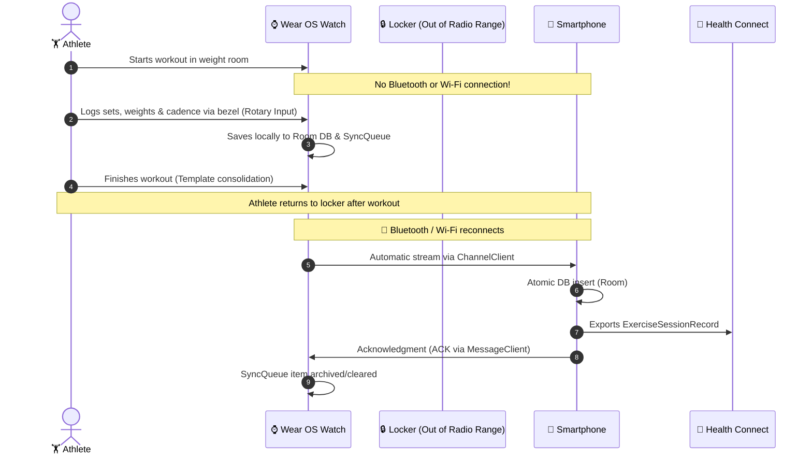
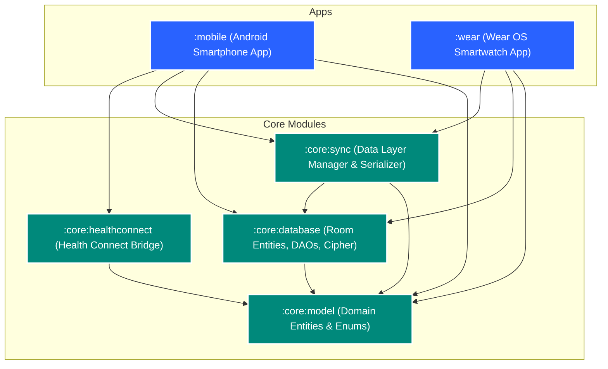
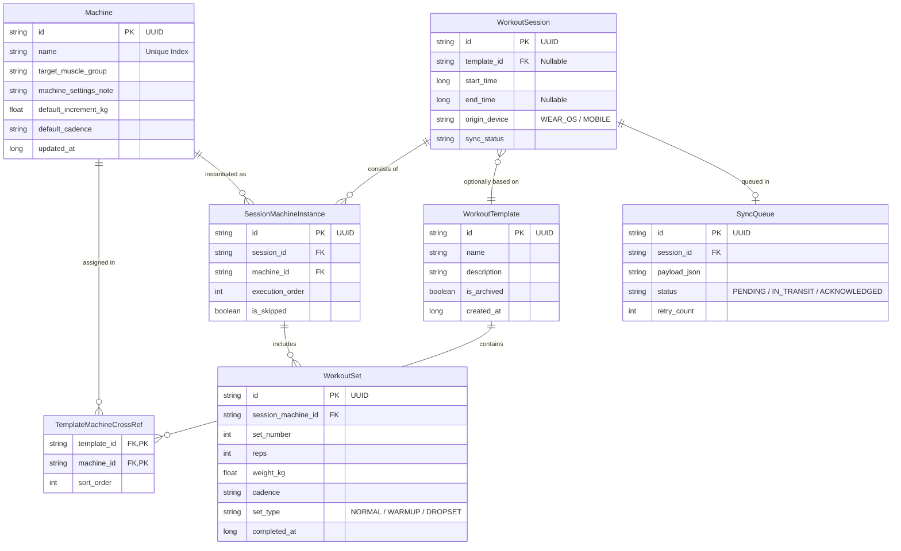

<div align="center">


# 🏋️‍♂️ LockerLift

### **Local-First, Open-Source Gym Tracker for Android & Wear OS**
*The smartphone stays in the locker – full autonomy on your smartwatch.*

[](https://github.com/christian98b/LockerLift/releases)
[](https://kotlinlang.org)
[](https://developer.android.com)
[](https://developer.android.com/wear)
[](https://developer.android.com/jetpack/compose)
[](https://developer.android.com/health-and-fitness/guides/health-connect)
[](https://developer.android.com/training/data-storage/room)
[](LICENSE)
[](https://github.com/christian98b/LockerLift/actions)

---

[📖 Documentation](#-documentation--resources) •
[🎯 The Locker Scenario](#-the-locker-scenario-locker-isolation) •
[✨ Key Features](#-key-features) •
[🏗️ Architecture & Modules](#-system-architecture--module-structure) •
[🔄 Sync Protocol](#-synchronization-protocol-wearable-data-layer) •
[🧪 Testing & Quality](#-unit-testing--quality-mandate) •
[🛠️ Setup & Build](#-getting-started--build) •
[📄 License](#-license)

---

</div>

## 🎯 The Locker Scenario (Locker Isolation)

> **Core Philosophy:**  
> Many strength athletes deliberately leave their smartphone in the locker room – to avoid distractions, prevent theft, or simply because bulky smartphones are cumbersome during heavy lifts.  
> **LockerLift is engineered specifically for this scenario.**



* **Not a Thin Client:** The smartwatch app is a full-featured, autonomous application backed by its own local Room database.
* **No Cloud Requirement:** Your training data belongs to you. It remains encrypted and stored locally on your devices.
* **Store-and-Forward Synchronization:** Workout records are queued locally and only transmitted once you return to the locker room.

---

## ✨ Key Features

### 📱 Smartphone App (`:mobile`)
* 🏋️ **Intuitive Live Workout Tracking & Set Table:** Full standalone tracking parity featuring a dedicated set table with side-by-side past performance comparisons, instant visual confirmation (`✓ Logged`), in-workout set editing and deletion, 3-dots actions (swap equipment while preserving sets, reorder stations), and smart next-exercise suggestions.
* 📋 **Global Machine & Exercise Catalog:** Equipment configured with target muscle groups, customized weight increments (e.g., 2.5 kg), and equipment setup notes (e.g., *"Seat height setting 4"*).
* 📑 **$n$-Template Management:** Unlimited training plans (Push, Pull, Legs, etc.) – including cold-start templates (create empty plans and fill on the fly).
* 📈 **Workout History with Full Editing:** Detailed insights into past sessions; edit logged weights and reps with steppers, add new sets, delete sets with contiguous re-indexing, or remove mistaken sessions with cascade database cleanup.
* 🔄 **Wear OS Companion & Sync Hub:** Monitor live smartwatch connectivity, view pending offline queue counts, and trigger manual synchronization for master data and workout history.
* 💾 **Local Backup & Restore:** Privacy-first export/import via Android Storage Access Framework (SAF) with GZip/JSON schema validation and SHA-256 integrity checks.
* 🌉 **Health Connect Bridge:** Seamless export and synchronized deletion with Google Fit, Samsung Health, and third-party fitness ecosystems.
* 🌐 **Multi-Language Support:** Localized in English (default) and German (`values-de/`).

### ⌚ Standalone Wear OS App (`:wear`)
* 🚀 **100% Autonomous Tracking:** Fully operational with zero smartphone connectivity.
* 🛡️ **Always-In-Foreground Tracking & Wake Behavior:** Active tracking runs as an ongoing health foreground service with dedicated window management (`singleTask`, `showWhenLocked`, `turnScreenOn`); waking the watch or raising the wrist returns directly to the active workout without dropping back to the watch face.
* ⚙️ **Rotary Input Support:** Lightning-fast rep and weight adjustments using the physical watch bezel or touch controls.
* ⏸️ **Workout Pause & Resume:** Pause active workouts seamlessly during interruptions; keeps the foreground service active while tracking true elapsed workout duration.
* ⏱️ **Configurable Rest Timer & Steppers:** Real-time `+15s` / `-15s` buttons without resetting countdowns; customizable default rest duration; explicit *"Set X logged — resting"* flow with one-tap continuation to the next set.
* 📝 **In-Workout Set Correction & Deletion:** Correct logged weights and reps or delete mistaken sets directly from machine cards with automatic sequential renumbering.
* 🔄 **Cold-Start & Ad-Hoc Modification:** Add, substitute, or skip machines in the middle of a workout session with clear *"Skip exercise"* labeling.
* ⚙️ **Wear OS Settings Screen:** Check phone connectivity, view offline sync queue items, trigger manual syncs to the phone, and inspect build info.
* 💡 **Template Consolidation:** Varied your routine during the workout? The app prompts on completion: *"Save variations into template?"*.
* 📊 **Progressive Overload Guidance:** Displays previous performance at each station with visual suggestions for weight increases (Double Progression).

---

## 🏗️ System Architecture & Module Structure

LockerLift utilizes a highly modular monorepo architecture with strict separation of concerns:



### Module Matrix

| Module | Type | Purpose & Contained Components |
|---|---|---|
| [`:core:model`](file:///C:/Users/Chris/code/LockerLift/core/model) | Pure Kotlin | Platform-independent domain models (`Machine`, `WorkoutSession`, `WorkoutSet`, enums). Zero Android dependencies. |
| [`:core:database`](file:///C:/Users/Chris/code/LockerLift/core/database) | Android Library | Room database, SQLite TypeConverters, DAOs (`MachineDao`, `WorkoutSessionDao`), relations & SQLCipher encryption. |
| [`:core:sync`](file:///C:/Users/Chris/code/LockerLift/core/sync) | Android Library | Google Play Services Wearable API encapsulation (`DataClient`, `ChannelClient`, `MessageClient`), JSON serialization, WorkManager queue worker. |
| [`:core:healthconnect`](file:///C:/Users/Chris/code/LockerLift/core/healthconnect) | Android Library | AndroidX Health Connect client, permission controller, record builder for `EXERCISE_TYPE_STRENGTH_TRAINING`. |
| [`:mobile`](file:///C:/Users/Chris/code/LockerLift/mobile) | Android App | Smartphone UI (Jetpack Compose Material 3), catalog, template, and history management, background sync listener service. |
| [`:wear`](file:///C:/Users/Chris/code/LockerLift/wear) | Wear OS App | Wear OS UI (Horologist & Wear Compose), Rotary Input, workout foreground service, rest timer with haptics. |

---

## 🗄️ Database Schema & Entities

All entities utilize **UUIDv4 (`String`) as primary keys** to enable decentralized, collision-free record generation across both watch and phone.



---

## 🔄 Synchronization Protocol (Wearable Data Layer)

LockerLift strictly segments channels within the Wearable Data Layer API:

<details>
<summary><b>1. Master Data (Machines & Templates) ➔ <code>DataClient</code></b></summary>

* **Paths:** `/equipment_catalog`, `/workout_templates`
* **Mechanism:** Automatically replicated key-value store (DataItem API).
* **Conflict Policy:** Smartphone is the **Master (Single Source of Truth)**. Machines and plans managed on the phone are automatically mirrored to paired watches.
</details>

<details>
<summary><b>2. Workout Sessions (History & Sets) ➔ <code>ChannelClient</code></b></summary>

* **Path:** `/workout_payload_transfer`
* **Mechanism:** Bidirectional byte stream for atomic transfers of comprehensive JSON payloads, including all sets, instances, and timestamps.
* **Conflict Policy:** Smartwatch is the **Master** for workouts executed on the watch.
</details>

<details>
<summary><b>3. Acknowledgment & RPC ➔ <code>MessageClient</code></b></summary>

* **Paths:** `/workout_ack`, `/sync_ping`
* **Mechanism:** Low-latency messages transmitting confirmation IDs (two-way handshake). After receiving an ACK, the session is cleared from the watch queue.
</details>

---

## 🧪 Unit Testing & Quality Mandate

> [!IMPORTANT]
> LockerLift enforces a **strict unit testing mandate**. All business calculations, progressions, enums, converters, mappers, and serializations are covered by unit tests.
> 
> **Zero Regression Guarantee:** All tests must pass cleanly upon future additions. A test may only be modified or deleted if the corresponding feature has been explicitly removed from specification.

### Included Unit Test Suites:
* [`DomainModelTest.kt`](file:///C:/Users/Chris/code/LockerLift/core/model/src/test/kotlin/com/lockerlift/core/model/DomainModelTest.kt): Validation of model instantiation, UUID uniqueness, defaults, and JSON serialization.
* [`SyncPayloadSerializerTest.kt`](file:///C:/Users/Chris/code/LockerLift/core/sync/src/test/kotlin/com/lockerlift/core/sync/SyncPayloadSerializerTest.kt): Lossless round-trip encoding and decoding of complex workout payload graphs.
* [`EntityMappingTest.kt`](file:///C:/Users/Chris/code/LockerLift/core/database/src/test/kotlin/com/lockerlift/core/database/EntityMappingTest.kt): Bidirectional mappings between domain models and Room entities, plus validation of all Room TypeConverters.

---

## 🤖 AI Agent & Developer Skills

The repository equips coding assistants and human developers with structured guidance in `.agents/skills/`:

* 🧭 [**`git-commit-guidelines`**](file:///C:/Users/Chris/code/LockerLift/.agents/skills/git-commit-guidelines/SKILL.md): Strict formatting rules following Conventional Commits (v1.0.0), module scopes, and mandatory test inclusion.
* 🧪 [**`unit-testing-guidelines`**](file:///C:/Users/Chris/code/LockerLift/.agents/skills/unit-testing-guidelines/SKILL.md): Standards for test structuring (AAA pattern, in-memory Room, coroutine testing).
* 🚀 [**`feature-implementation-workflow`**](file:///C:/Users/Chris/code/LockerLift/.agents/skills/feature-implementation-workflow/SKILL.md): 8-step lifecycle from user stories through architecture validation to atomic commits.
* 📦 [**`release-versioning-rules`**](file:///C:/Users/Chris/code/LockerLift/.agents/skills/release-versioning-rules/SKILL.md): Criteria catalog for SemVer 2.0.0 (Major vs. Minor vs. Patch) and Gradle release bumps.
* 🚀 [**`release-creation-guide`**](file:///C:/Users/Chris/code/LockerLift/.agents/skills/release-creation-guide/SKILL.md): End-to-end operational guide for drafting, tagging, packaging, and publishing official releases via GitHub CLI.
* 🌐 [**`internationalization-guide`**](file:///C:/Users/Chris/code/LockerLift/.agents/skills/internationalization-guide/SKILL.md): Step-by-step instructions for adding new language locales, string extraction, and formatting rules.
* ✍️ [**`user-documentation-guide`**](file:///C:/Users/Chris/code/LockerLift/.agents/skills/user-documentation-guide/SKILL.md): Standards and visual design principles for creating structured, beautiful, and user-centric documentation.
* 📋 [**`issue-creation-guide`**](file:///C:/Users/Chris/code/LockerLift/.agents/skills/issue-creation-guide/SKILL.md): Standards, required templates, label taxonomies, and CLI workflows for filing well-structured issues.
* 🏷️ [**`issue-closing-and-commenting-guide`**](file:///C:/Users/Chris/code/LockerLift/.agents/skills/issue-closing-and-commenting-guide/SKILL.md): Standards, quality gates, and structured Markdown templates for verifying, commenting on, and closing GitHub issues.

---

## 📖 Documentation & Resources

### 📚 User Guides & Manuals
Comprehensive user documentation is available in the [`documentation/`](documentation/README.md) directory:

| Guide | Description |
|---|---|
| [**Documentation Portal**](documentation/README.md) | Central hub with navigation index and visual system architecture map. |
| [**🚀 Getting Started & Installation**](documentation/getting-started.md) | Step-by-step setup, sideloading APKs, ADB wireless debugging, and initial cold-start. |
| [**🔒 The Locker Scenario & Sync**](documentation/locker-scenario-guide.md) | Deep dive into offline tracking, the 5-phase Store-and-Forward lifecycle, and reconnect resilience. |
| [**⌚ Wear OS Smartwatch Tracking Guide**](documentation/wear-os-user-guide.md) | Autonomous on-wrist tracking, rotary dial input, double progression cues, rest timer haptics, and template consolidation. |
| [**📱 Mobile Smartphone App Guide**](documentation/mobile-user-guide.md) | Equipment catalog management, workout templates, session history analysis, Health Connect sync, and multi-language support. |
| [**❓ FAQ & Troubleshooting**](documentation/faq-troubleshooting.md) | Frequently asked questions, sync diagnostics flowchart, battery optimizations, and known fixes. |

### 🛠️ Developer & Technical References

| Document | Description |
|---|---|
| [**GitHub Issues & User Stories**](https://github.com/christian98b/LockerLift/issues) | Complete specification (Epics 1 through 6, US 1.1–US 6.2) tracked as GitHub Issues. |
| [**`ARCHITECTURE.md`**](ARCHITECTURE.md) | Technical system architecture, ER diagrams, sequence diagrams, and Wear OS invariants. |
| [**`AGENTS.md`**](AGENTS.md) | Developer guidelines, invariant mandates, multi-agent orchestration, and active implementation progress log. |

---

## 🛠️ Getting Started & Build

### Prerequisites
* **Java Development Kit (JDK):** Version 21
* **Android SDK:** Build-Tools 35, Compile SDK 35 (Min SDK: 28 for phone, 30 for Wear OS)
* **Gradle:** 8.7+

### Running Unit Tests
```bash
# Run all unit tests across modules
./gradlew test
```

### Building Application APKs
```bash
# Build Mobile Smartphone APK
./gradlew :mobile:assembleDebug

# Build Wear OS Smartwatch APK
./gradlew :wear:assembleDebug
```

---

## 📄 License

LockerLift is open-source software licensed under the **[Apache License, Version 2.0](LICENSE)**.

```
Copyright 2026 Christian Bruns

Licensed under the Apache License, Version 2.0 (the "License");
you may not use this file except in compliance with the License.
You may obtain a copy of the License at

    http://www.apache.org/licenses/LICENSE-2.0

Unless required by applicable law or agreed to in writing, software
distributed under the License is distributed on an "AS IS" BASIS,
WITHOUT WARRANTIES OR CONDITIONS OF ANY KIND, either express or implied.
See the License for the specific language governing permissions and
limitations under the License.
```

---

<div align="center">
<b>LockerLift</b> • Built for strength athletes demanding complete focus and absolute data sovereignty.
</div>
