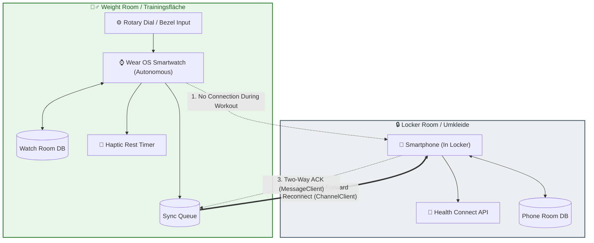

# 📖 LockerLift Documentation Portal

Welcome to the official user and technical documentation for **LockerLift**, the privacy-first, local-first strength training tracker for Android and Wear OS.

> **LockerLift Core Philosophy:**  
> Your smartphone stays locked safely in the locker room. Your smartwatch tracks your workout 100% autonomously without requiring Bluetooth, Wi-Fi, or cloud connectivity.

---

## 🧭 Documentation Navigator

Explore the user guides, device manuals, and troubleshooting articles below:

| Guide | Target Audience | Description |
|---|---|---|
| [**🚀 Getting Started**](getting-started.md) | All Users | Installing APKs, first-time device pairing, permissions, and initial setup. |
| [**🔒 The Locker Scenario & Sync**](locker-scenario-guide.md) | All Users | How autonomous offline tracking and the Store-and-Forward sync protocol work. |
| [**⌚ Wear OS Tracking Guide**](wear-os-user-guide.md) | Athletes / Watch Users | Rotary input, set logging, rest timer, Double Progression, and ad-hoc stations. |
| [**📱 Mobile App & Catalog Guide**](mobile-user-guide.md) | Athletes / Phone Users | Machine catalog, setup notes, $n$-templates, workout history, and Health Connect. |
| [**❓ FAQ & Troubleshooting**](faq-troubleshooting.md) | All Users | Common questions, sync diagnostics, battery optimization, and troubleshooting. |

---

## 🏗️ System Overview

The following diagram illustrates how the components of the LockerLift ecosystem interact during a typical workout day:

---

## 💡 Quick Rules of Thumb

1. **Watch Operates 100% Offline:** You never need to bring your phone to the gym floor. You will never encounter a "Connection Lost" error.
2. **Local Storage First:** All equipment, templates, and workouts are stored locally on your device in an encrypted Room SQLite database.
3. **Automatic Synchronization:** As soon as you step back into the locker room within Bluetooth or Wi-Fi range of your phone, your workout streams automatically to your phone and exports to Health Connect.

---

[Next: 🚀 Getting Started Guide ➔](getting-started.md)
