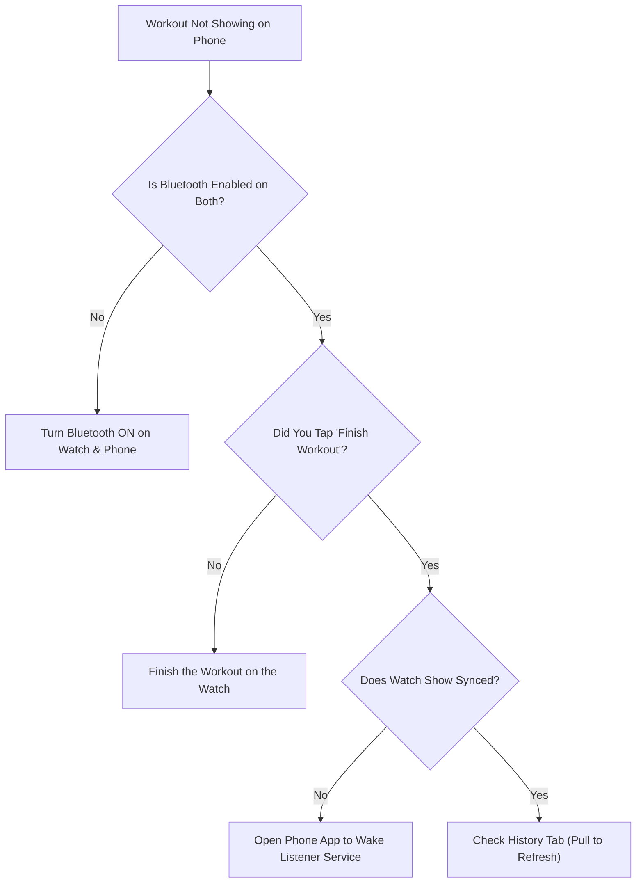

# ❓ Frequently Asked Questions & Troubleshooting

> **Quick answers to common questions, device synchronization diagnostics, and troubleshooting tips for LockerLift.**

---

[❓ General FAQ](#-general-faq) • [🔄 Sync Diagnostics](#-synchronization-diagnostics) • [🔋 Battery & Wear OS Tracking](#-battery--wear-os-tracking) • [💚 Health Connect Issues](#-health-connect-troubleshooting)

---

## ❓ General FAQ

<b>Do I need an internet connection or cellular (LTE) smartwatch?</b>

**No.** LockerLift is strictly **local-first**. The watch app requires zero internet access, zero cellular connectivity, and zero active Wi-Fi while you are lifting. Everything runs locally on your wrist. Data transfer between watch and phone uses local Bluetooth or local Wi-Fi when you return to your locker.

<b>Does LockerLift require an account, cloud login, or subscription?</b>

**No.** LockerLift is 100% free, open-source software (FOSS). There are no user accounts, no tracking analytics, no paywalls, and no external servers. Your training data belongs exclusively to you.

<b>Can I use LockerLift without a Wear OS smartwatch?</b>

Yes. You can manage your machine catalog, plan workout templates, and view history directly on your smartphone. However, the automated "Locker Scenario" is designed specifically around Wear OS devices.

<b>How long will a workout stay queued on my watch if my phone is dead?</b>

Indefinitely. Completed sessions are persisted in the watch's internal SQLite database (`SyncQueue`). They will remain securely saved until your phone turns on, reconnects, and completes the two-way acknowledgment handshake.

<b>What languages are supported?</b>

LockerLift supports **English** (default base language) and **German** (`values-de/`). Additional languages can be added easily by following the [internationalization-guide](../.agents/skills/internationalization-guide/SKILL.md).

---

## 🔄 Synchronization Diagnostics

If your completed workout has not appeared on your smartphone's **History** tab after returning to the locker, walk through this checklist:

### 1. Verify Bluetooth Connection
* Ensure your watch is paired and showing connected in your watch companion app (e.g., Galaxy Wearable, Pixel Watch app).
* If your gym has Wi-Fi and both devices are on the same network, sync can also occur over local Wi-Fi automatically.

### 2. Confirm the Session was Finished
* The watch only transmits workouts that have been explicitly completed.
* If your workout is still active, scroll to the bottom of the screen on your watch and tap **Finish Workout**.

### 3. Wake Up the Phone App
* While Android typically wakes background services automatically, aggressive battery savers on some phone brands (Xiaomi, Huawei, Samsung) can suspend background listeners.
* Simply unlock your phone and open LockerLift to trigger immediate ingestion.

---

## 🔋 Battery & Wear OS Tracking

### Why does LockerLift use a Foreground Service?
Android's power manager aggressively suspends background apps on smartwatches to conserve battery. LockerLift runs your active workout inside an Android **Foreground Service** registering an **Ongoing Activity** notification. This ensures:
1. Your set rest timer and rep counters are never paused mid-workout.
2. The app remains alive when the screen dims into Ambient Mode.
3. Returning to your watch face shows an active gym icon to quickly jump back into your session.

> [!TIP]
> To maximize watch battery life during a 2-hour workout:
> * Turn off Wi-Fi on the watch during your workout (LockerLift doesn't need it!).
> * Lower screen brightness or rely on Ambient Mode between sets.

---

## 💚 Health Connect Troubleshooting

### Workouts Not Showing in Google Fit or Samsung Health
1. **Check Permissions:**
   * On your phone, go to **Settings ➔ Security & Privacy ➔ Privacy ➔ Health Connect ➔ App Permissions ➔ LockerLift**.
   * Verify that **Exercise**, **Heart Rate**, and **Total Calories** have write permissions enabled.
2. **Verify Connected Apps in Health Connect:**
   * In Health Connect settings, confirm that your destination app (e.g., Google Fit or Samsung Health) has permission to **Read** Exercise Sessions.
   * Health Connect acts as the central hub; both apps must have matching read/write permissions.

---

[Back to Documentation Portal ➔](README.md)
