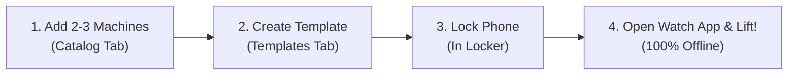

# 🚀 Getting Started with LockerLift

> **Quickly set up LockerLift on your Android smartphone and Wear OS smartwatch in under five minutes.**

---

[📖 Overview](#-overview) • [📥 Installation](#-installation) • [🔑 Permissions](#-permissions--initial-setup) • [⚡ 3-Minute Quick Start](#-3-minute-quick-start) • [❓ Need Help?](#-need-help)

---

## 📖 Overview

LockerLift consists of two companion applications working together seamlessly:
1. **The Mobile Smartphone App (`:mobile`):** Where you configure equipment, create workout templates, view historical charts, and manage exports to Google Health Connect.
2. **The Wear OS Smartwatch App (`:wear`):** Your standalone gym companion that records exercises, weights, reps, and cadence on the gym floor while your phone rests in the locker.

---

## 📥 Installation

### Prerequisites
* **Android Smartphone:** Android 9.0 (API Level 28) or higher.
* **Wear OS Smartwatch:** Wear OS 3.0 (API Level 30) or higher (e.g., Samsung Galaxy Watch 4/5/6/7, Google Pixel Watch 1/2/3, TicWatch Pro).
* **Health Connect:** Pre-installed on Android 14+ or downloaded from Google Play Store for Android 9–13.

### Download APKs
Pre-compiled debug APKs are generated on every release and CI build:
1. Navigate to the [GitHub Actions Artifacts](https://github.com/christian98b/LockerLift/actions).
2. Download the latest `LockerLift-APKs-<commit-hash>` archive.
3. Extract the two files:
   * `mobile-debug.apk`
   * `wear-debug.apk`

### Installing on your Smartphone
1. Transfer `mobile-debug.apk` to your phone.
2. Open the file via your file manager and tap **Install**.
3. If prompted, enable *"Install from unknown sources"* for your file manager.

### Installing on your Wear OS Smartwatch (via Wireless ADB)
Because Wear OS devices don't have standard file managers, install the watch APK using Wireless ADB:
1. On your watch, go to **Settings ➔ System ➔ About ➔ Versions**.
2. Tap **Build number** 7 times to enable Developer Options.
3. Go back to **Settings ➔ Developer Options**.
4. Enable **ADB Debugging** and **Wireless Debugging** (connect to the same Wi-Fi as your PC).
5. Note the IP address and port shown (e.g., `192.168.1.50:5555`).
6. From your computer terminal, connect and install:
   ```bash
   adb connect 192.168.1.50:5555
   adb install wear-debug.apk
   ```

> [!TIP]
> You can also use free companion apps like **Bugjaeger** or **Easy Fire Tools** directly from your phone to wirelessly push `wear-debug.apk` to your watch without touching a computer!

---

## 🔑 Permissions & Initial Setup

### Smartphone Permissions
When you launch LockerLift Mobile for the first time:
1. **Health Connect Authorization:**  
   When prompted, grant LockerLift write permissions for:
   * `Exercise Session` (persists your completed strength workouts)
   * `Heart Rate` (records workout intensity telemetry)
   * `Total Calories Burned` (records active energy expenditure)

> [!NOTE]
> If you decline Health Connect permissions, LockerLift will continue functioning completely normally; workouts simply won't export to third-party health apps.

### Smartwatch Permissions
When launching LockerLift Wear for the first time:
1. **Notifications:** Allow notifications so LockerLift can display the active workout status on your watch face and ambient display.

---

## ⚡ 3-Minute Quick Start

Follow this quick walkthrough to prepare for your first workout:



### Step 1: Add your Favorite Machines (Phone)
1. Open LockerLift on your phone and select the **Catalog** tab.
2. Tap the floating **+** button.
3. Enter:
   * **Name:** *Lat Pulldown*
   * **Muscle Group:** *Back*
   * **Settings Note:** *Seat level 4, wide grip*
   * **Increment:** *2.5 kg*
4. Tap **Save**. Add a second machine (e.g., *Chest Press*).

### Step 2: Build a Workout Template (Phone)
1. Select the **Templates** tab.
2. Tap the floating **+** button.
3. Name your plan (e.g., *Upper Body A*).
4. Tap **Create**.

### Step 3: Head to the Gym!
1. Leave your phone safely locked in your locker.
2. Open LockerLift on your Wear OS watch.
3. Tap your new template or choose **Free Workout**.
4. Log your sets and enjoy distraction-free lifting!

---

[Next: 🔒 The Locker Scenario & Sync Guide ➔](locker-scenario-guide.md)
