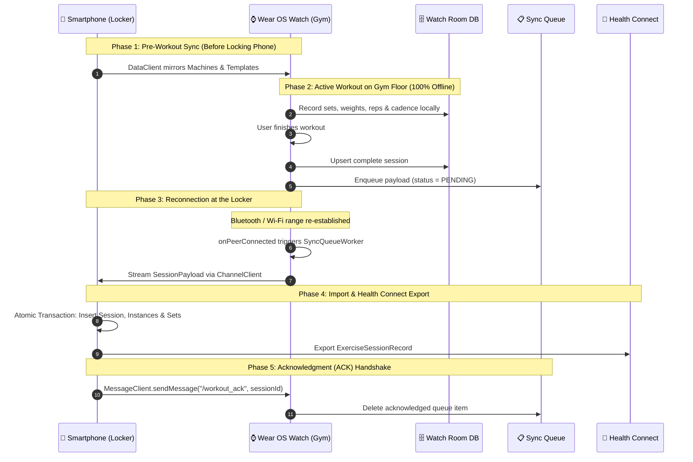

# 🔒 The Locker Scenario & Sync Architecture

> **Understand why LockerLift was built, how offline smartwatch autonomy works, and how your data seamlessly syncs when you return to your locker.**

---

[🎯 The Problem](#-the-problem-with-traditional-gym-apps) • [💡 The Locker Principle](#-the-lockerlift-philosophy) • [🔄 Synchronization Lifecycle](#-the-5-phase-synchronization-lifecycle) • [🛡️ Edge Case Resilience](#️-edge-case-resilience)

---

## 🎯 The Problem with Traditional Gym Apps

Traditional fitness apps force lifters into constant smartphone dependency:
* 📱 **Distraction & Loss of Focus:** Checking a phone between sets inevitably leads to social media notifications, messages, and prolonged rest periods.
* 💥 **Hardware Risk:** Phones left on gym benches or rubber floors frequently get crushed by dropped dumbbells or barbell plates.
* 📶 **Gym Dead Zones:** Many basement gyms have zero cellular or Wi-Fi reception, causing cloud-dependent apps to hang or lose uncommitted sets.
* 🔋 **Excessive Battery Drain:** Keeping phone screens active throughout a 90-minute session drains battery life.

**LockerLift was built from the ground up to solve this.**

---

## 💡 The LockerLift Philosophy

LockerLift operates on an invariant principle:
> **The smartphone stays locked in your locker. Your watch handles 100% of your workout locally with zero latency, zero errors, and zero connection requirements.**

### How this is Achieved Architecturally:
1. **Not a Companion Remote:** Unlike other apps where the watch simply acts as a display mirror for a phone app, LockerLift on Wear OS is a **standalone Android application** running its own local SQLite Room database.
2. **Collision-Free UUIDv4 Keys:** All entities (workouts, sets, machines) use globally unique UUIDs (`UUID.randomUUID().toString()`). New machines or workouts created on the watch can never conflict with IDs created on the phone.
3. **Store-and-Forward Queue:** Completed sessions are saved in an internal queue (`SyncQueue`) on the watch. You can finish your workout, take a shower, and sync hours later without losing a single rep.

---

## 🔄 The 5-Phase Synchronization Lifecycle

### Phase 1: Pre-Workout Master Data Mirroring
* Whenever your phone and watch are in Bluetooth range, master data (the machine catalog and workout plans) is replicated via the Google Play Services **`DataClient`**.
* The phone is the **Single Source of Truth** for equipment names and templates.

### Phase 2: Standalone Workout Execution
* You walk out to the weights area. The Bluetooth connection drops.
* The watch continues tracking without interruption.
* Completed sets and custom notes are stored in local watch storage.
* Once you tap **Finish Workout**, a JSON payload is created and saved to `SyncQueue` with state `PENDING`.

### Phase 3: Automatic Reconnection
* After training, you return to the locker room.
* As soon as your watch reconnects via Bluetooth or gym Wi-Fi, the Android Wearable subsystem fires `onPeerConnected`.
* A background `WorkManager` job (`SyncQueueWorker`) automatically activates.
* It opens a high-bandwidth byte stream via **`ChannelClient`** to stream the complete workout session to the phone.

### Phase 4: Smartphone Ingestion & Health Connect Export
* The phone's `MobileDataLayerListenerService` receives the stream.
* In a single atomic database `@Transaction`, it persists the workout session, exercises, and sets.
* It immediately sends the session to **Android Health Connect** as an `EXERCISE_TYPE_STRENGTH_TRAINING` record.

### Phase 5: Two-Way Acknowledgment (ACK)
* The phone sends a fast acknowledgment packet back to the watch via **`MessageClient`**.
* Upon receipt of the ACK, the watch purges the session from its `SyncQueue`.
* Both devices are now perfectly in sync.

---

## 🛡️ Edge Case Resilience

| Scenario | What Happens? | User Action Required |
|---|---|---|
| **Phone was switched off or dead** | The watch keeps the session in `SyncQueue` indefinitely. | None. Sync will automatically trigger the next time the phone turns on and pairs. |
| **Watch battery dies mid-workout** | The `WorkoutForegroundService` persists every set immediately upon completion. | Power on the watch. Your completed sets are already saved in the database. |
| **I added a new machine on the watch** | The watch creates an ad-hoc machine and transmits it inside the workout payload. | Upon sync, the phone automatically adds the new machine to your master catalog! |
| **Bluetooth disconnects mid-sync** | `ChannelClient` automatically aborts and `SyncQueueWorker` retries with exponential backoff. | None. The system guarantees atomic delivery. |

---

[Next: ⌚ Wear OS Tracking Guide ➔](wear-os-user-guide.md)
