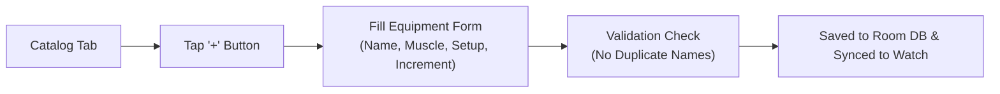

# 📱 Mobile Smartphone App & Catalog Guide

> **Master equipment setup notes, custom weight increments, multi-template programming, workout history, and Health Connect integration on your smartphone.**

---

[📋 Machine Catalog](#-machine-catalog-management) • [📑 Template Management](#-workout-template-management) • [📈 Workout History](#-workout-history--session-analysis) • [🌉 Health Connect Integration](#-health-connect-bridge) • [🌐 Language Settings](#-language-settings)

---

## 📋 Machine Catalog Management

The **Catalog** tab (`CatalogScreen`) acts as your personal equipment registry. Every gym has slightly different machines, plate configurations, and adjustments. LockerLift allows you to record exact settings so you never forget your seat height or pin position again.



### Adding a New Machine
1. Open the LockerLift app on your phone and tap the **Catalog** tab on the bottom navigation bar.
2. Tap the floating **+** button.
3. Complete the equipment fields:
   * **Name:** Unique identifier for the equipment (e.g., *Incline Chest Press*, *Seated Cable Row*).
   * **Target Muscle Group:** Primary muscle targeted (e.g., *Chest*, *Back*, *Hamstrings*, *Shoulders*).
   * **Device Settings Note (Optional):** Crucial setup details so you can immediately configure the machine at the gym (e.g., *"Seat level 5, backrest angle 2, handle 3"*).
   * **Increment (kg):** The smallest weight step available on this specific weight stack or barbell (e.g., `2.5` kg for cable stacks, `1.25` kg for plate-loaded barbells).
4. Tap **Save**.

> [!IMPORTANT]
> LockerLift enforces strict uniqueness on machine names to prevent duplicate entries from cluttering your watch interface. If a machine with that name already exists, you will be prompted to choose a distinctive name.

---

## 📑 Workout Template Management

The **Templates** tab (`TemplateListScreen`) provides $n$-template programming capabilities. You can create as many training splits or single-day routines as your program requires.

### Supported Routine Styles:
* **Push / Pull / Legs (PPL)**
* **Upper / Lower Split**
* **Full Body Routines**
* **Specialized Rehab or Arm Days**

### Creating a Template
1. Navigate to the **Templates** tab.
2. Tap the floating **+** button.
3. Enter a **Name** (e.g., *Leg Day - Quad Focus*) and an optional **Description** (e.g., *Heavy squat progression followed by hack squat and leg extensions*).
4. Tap **Create**.

### Cold-Start Templates (Zero-Prep Plans)
Don't have time to configure all exercises before heading to the gym?
* Create an empty template with just a name (e.g., *Exploratory Leg Day*).
* At the gym, launch this template on your watch. Use the **+ Add Exercise** button to build the plan on the fly.
* At the end of the session, the watch will offer to consolidate your selections back into the template on your phone!

---

## 📈 Workout History & Session Analysis

The **History** tab (`HistoryScreen`) provides a clear, chronological archive of all completed workout sessions:

```text
┌────────────────────────────────────────────────────────┐
│ Upper Body A                           WEAR_OS (Watch) │
│ 13.09.2026 18:30                                       │
│ ────────────────────────────────────────────────────── │
│ • Lat Pulldown: 60.0kg × 12, 62.5kg × 10, 62.5kg × 8   │
│ • Incline Dumbbell Press: 32.0kg × 10, 32.0kg × 9      │
│ • Cable Lateral Raise: 7.5kg × 15, 7.5kg × 14          │
└────────────────────────────────────────────────────────┘
```

### Key Historical Details:
* **Template Title:** Name of the routine performed (or *Free Workout* if run ad-hoc).
* **Device Origin Badge:** Displays whether the session was logged on your Wear OS watch (`WEAR_OS`) or directly on your phone (`MOBILE`).
* **Session Date & Time:** Formatted according to your phone's locale.
* **Set Breakdown:** Every completed set with exact weight in kg and completed repetitions.

---

## 🌉 Health Connect Bridge

LockerLift connects directly with Android's unified health database:

### How Export Works:
1. When your Wear OS watch finishes syncing a workout to your phone via `ChannelClient`, the phone's `MobileDataLayerListenerService` automatically checks Health Connect availability.
2. If permissions are granted, an `ExerciseSessionRecord` is created with:
   * **Exercise Type:** `EXERCISE_TYPE_STRENGTH_TRAINING`
   * **Start & End Timestamps:** Exact workout duration
   * **Workout Title:** Template name or *"Free Workout (LockerLift)"*
3. Compatible apps (such as **Google Fit**, **Samsung Health**, **Peloton**, or **MyFitnessPal**) immediately read the session from Health Connect without any manual export/import steps!

---

## 🌐 Language Settings

LockerLift features full internationalization support:
* **Default Language:** English
* **German Translation:** Supported natively (`values-de/`)

### Changing App Language:
* **Android 13+ (Per-App Language):**  
  Go to **Phone Settings ➔ Apps ➔ LockerLift ➔ Language** and select your preferred language (English or German).
* **Android 9–12:**  
  LockerLift automatically adapts to your smartphone's primary system display language.

---

[Next: ❓ FAQ & Troubleshooting ➔](faq-troubleshooting.md)
