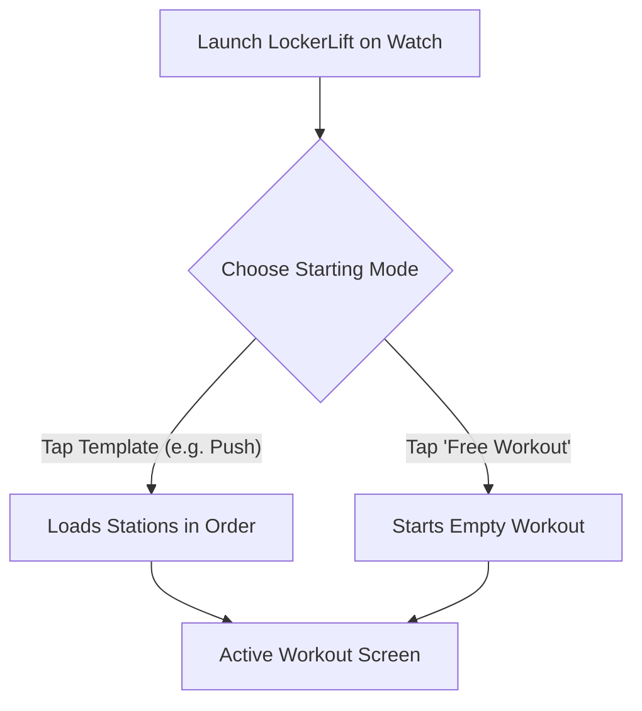
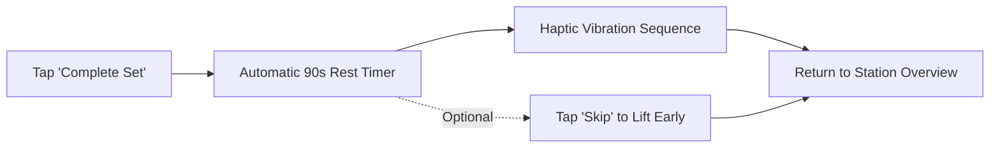
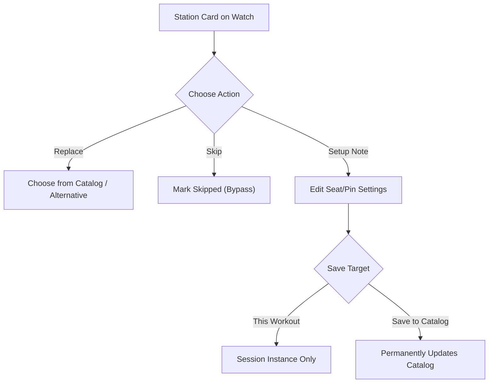

# ⌚ Wear OS Smartwatch Tracking Guide

> **Your comprehensive guide to logging sets, utilizing rotary bezel input, leveraging Double Progression, and managing workouts entirely on your smartwatch.**

---

[🚀 Starting a Workout](#-starting-a-workout) • [⚙️ Rotary Dial & Controls](#-rotary-dial--bezel-controls) • [📈 Double Progression](#-progressive-overload--double-progression) • [⏱️ Rest Timer & Haptics](#️-rest-timer--haptic-alerts) • [🔄 Ad-Hoc Exercises & Skipping](#-ad-hoc-exercises--skipping) • [💾 Finishing & Consolidation](#-finishing-the-workout--template-consolidation)

---

## 🚀 Starting a Workout

When you launch LockerLift on your Wear OS watch, you are presented with the **Template Selection Screen**:



### Option A: Selecting a Predefined Template
* Scroll through your synced templates (e.g., *Push*, *Pull*, *Legs*).
* Tap any template to immediately instantiate a workout session. The exercises and target weights will load in order.

### Option B: Free Workout (Ad-Hoc)
* If you do not follow a fixed schedule today, tap **Free Workout**.
* You can add stations on the fly as you move around the gym floor.

> [!NOTE]
> Starting an active workout automatically initiates LockerLift's **`WorkoutForegroundService`**. This registers an ongoing activity notification and keeps the tracking engine active even when the screen enters low-power Ambient Mode.

---

## ⚙️ Rotary Dial & Bezel Controls

LockerLift is optimized for round displays and physical hardware dials:

```text
    ┌─────────────────────────┐
    │     Lat Pulldown        │
    │        Set 1            │
    │  [-]   62.5 kg   [+]    │  <-- Physical bezel scrolls weight
    │  [-]   10 reps   [+]    │  <-- Quick tap buttons for exact adjustments
    │                         │
    │   [ Complete Set ]      │
    └─────────────────────────┘
```

### How to Adjust Values:
1. **Physical Bezel / Crown:** Rotate the bezel clockwise to increase weight or reps; rotate counter-clockwise to decrease. Tactile haptic clicks confirm each detent step.
2. **Quick Buttons (`+` / `-`):** Tap the `+` or `-` buttons to step in increments matching the machine's configured `defaultIncrementKg` (e.g., 2.5 kg or 1.25 kg).
3. **Rep Incrementing:** Quick buttons increment or decrement single reps effortlessly with sweaty hands or gloves.

---

## 📈 Progressive Overload & Double Progression

LockerLift implements intelligent, on-wrist **Double Progression** to help you build strength systematically:

### What is Double Progression?
Instead of adding weight every workout, you first progress in repetitions within a target bracket (e.g., 8–12 reps) with a fixed weight. Once you hit the upper ceiling (12 reps), you increase the weight and drop back to the lower floor (8 reps).

### How LockerLift Guides You on the Watch:
* When you log a set that achieves or exceeds the target repetition threshold (default: 12 reps), LockerLift displays a **Progression Suggestion Card**:
  ```text
  ┌───────────────────────────────────┐
  │  💡 Suggestion: Increase +2.5 kg? │
  └───────────────────────────────────┘
  ```
* **One-Tap Overload:** Tapping this suggestion card automatically increases the working weight by the machine's exact increment for your next set.
* If you feel fatigued or choose not to increase yet, simply ignore the card.

---

## ⏱️ Rest Timer & Haptic Alerts

Recovery between heavy sets is critical for strength development:



### Rest Timer Features:
1. **Automatic Activation:** Immediately upon tapping **Complete Set**, the rest countdown screen appears.
2. **Multi-Pulse Haptic Vibration:** When the timer reaches `00:00`, your watch vibrates with a distinct multi-burst waveform. You don't need to look at your watch or listen for beeps over loud gym music.
3. **Skip Button:** Feeling ready earlier? Tap **Skip** at any time to return directly to your exercise list.

---

### Historical Reference Data & Intelligent Prefilling
Never wonder what weight you lifted last week:
* **Automatic Performance Recall:** Whenever you select an exercise, LockerLift queries your local database and prominently displays your past performance at the top of the input dialog:
  ```text
  ┌───────────────────────────────────┐
  │  📊 Last: 80 kg × 10, 80 kg × 9   │
  └───────────────────────────────────┘
  ```
* **Auto-Prefill:** For your first set, LockerLift automatically pre-fills the weight and reps from your last completed workout, so you can immediately begin without scrolling from zero.

---

## ⏱️ Rest Timer & Haptic Alerts

Recovery between heavy sets is critical for strength development:


### Rest Timer Features:
1. **Automatic Activation:** Immediately upon tapping **Complete Set**, the rest countdown screen appears.
2. **Multi-Pulse Haptic Vibration:** When the timer reaches `00:00`, your watch vibrates with a distinct multi-burst waveform. You don't need to look at your watch or listen for beeps over loud gym music.
3. **Skip Button:** Feeling ready earlier? Tap **Skip** at any time to return directly to your exercise list.

---

## 🔄 In-Workout Station Management: Replace, Skip & Create

Gyms get crowded. If a piece of equipment is occupied or broken, LockerLift adapts seamlessly:



### 1. Replacing a Station (US 3.3)
If a barbell bench or cable station is occupied:
1. On the station card, tap **Replace**.
2. Browse your synced catalog or create a replacement.
3. The selected machine replaces the station in your active workout without altering the original template.

### 2. Skipping & Resuming Stations (US 3.3)
* Tap **Skip** on any station to bypass it. The card dims (`surfaceContainerLow`) and displays a **Skipped** badge.
* If the machine becomes free later, tap **Resume** to reactivate and log your sets.

### 3. Creating New Machines on the Watch (Cold-Start US 1.1 & US 3.2)
Don't have a machine in your catalog yet?
1. Tap **+ Add exercise** at the bottom of the workout screen.
2. Tap **+ New Machine**.
3. Choose or enter the name, select the weight increment (e.g., 2.5 kg), and tap save.
4. Duplicate names are automatically detected and prevented locally. The new machine is appended to your workout and saved to your equipment catalog!

### 4. Updating Setup Notes on the Fly (US 1.2)
Changed your seat height or peg position?
1. Tap **Setup Note** on the station card.
2. Adjust your note using quick presets (e.g., *Seat 2*, *Pin 4*, *Peg 3*) or text input.
3. Choose:
   * **Workout Only:** Saves the note for today's workout.
   * **Save to Catalog:** Updates your permanent machine catalog so you remember it next time!

---

## 💾 Finishing the Workout & Template Consolidation

When you complete your training, scroll to the bottom and tap **Finish Workout**:

### The Template Consolidation Dialog
If you added new exercises, swapped stations, or adjusted your routine during the session, LockerLift asks:

> **"Save changes back into template?"**

* **Yes (Consolidate):** Your underlying workout template is updated so the new exercises appear next time automatically.
* **No (Keep Original):** Today's variations are saved solely to this specific workout history. Your master template remains untouched.

> [!TIP]
> This decoupling guarantees that spontaneous gym improvisations never accidentally ruin your carefully structured long-term training plans.

---

[Next: 📱 Mobile App & Catalog Guide ➔](mobile-user-guide.md)
