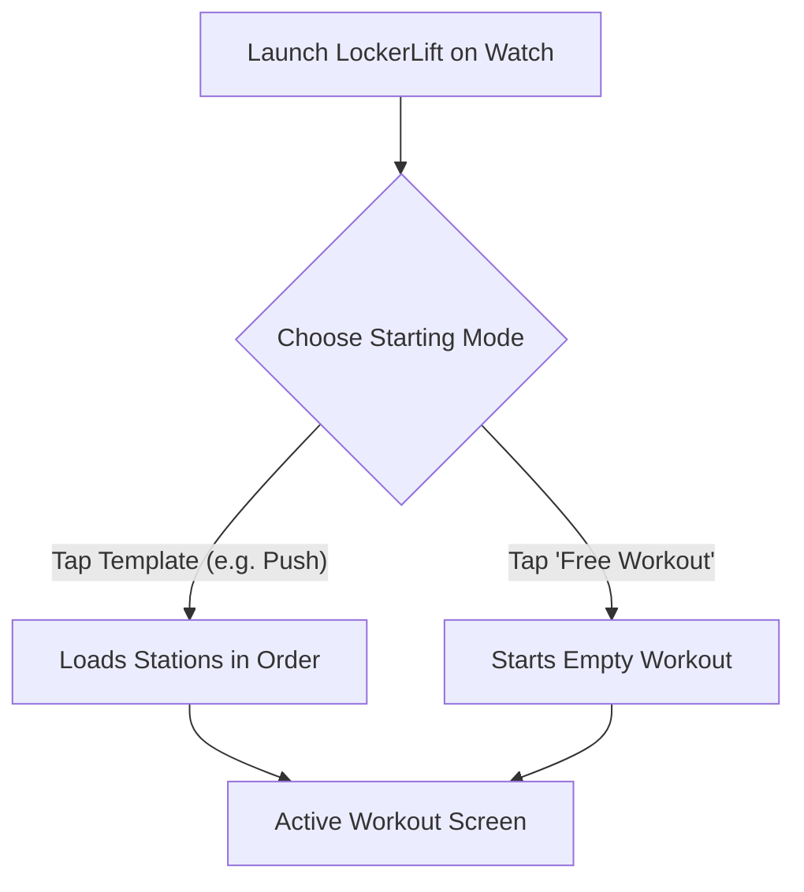
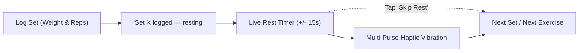
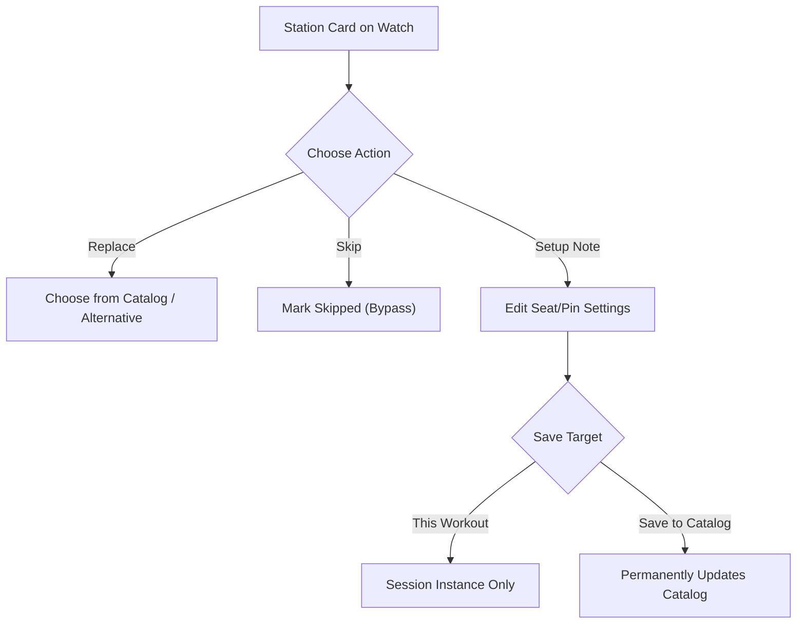
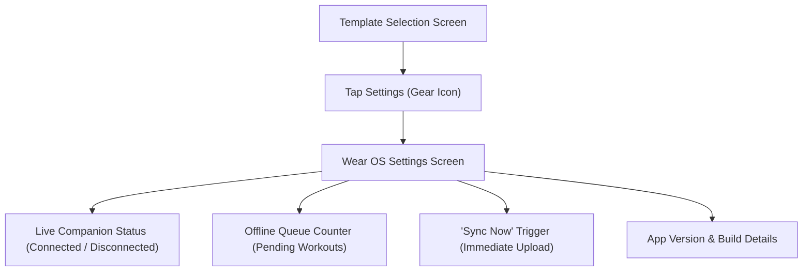

# ⌚ Wear OS Smartwatch Tracking Guide

> **Your comprehensive guide to logging sets, utilizing rotary bezel input, leveraging Double Progression, and managing workouts entirely on your smartwatch.**

---

[🚀 Starting a Workout](#-starting-a-workout) • [⏸️ Pause & Resume](#️-workout-pause--resume) • [⚙️ Rotary Dial & Controls](#-rotary-dial--bezel-controls) • [📈 Double Progression](#-progressive-overload--double-progression) • [⏱️ Rest Timer & Haptics](#️-rest-timer--haptic-alerts) • [📝 In-Workout Set Correction](#-in-workout-set-correction--deletion) • [🔄 Station Management](#-in-workout-station-management-replace-skip--create) • [⚙️ Companion Settings](#️-wear-os-companion-settings--sync) • [💾 Finishing](#-finishing-the-workout--template-consolidation)

---

## 🚀 Starting a Workout

When you launch LockerLift on your Wear OS watch, you are presented with the **Template Selection Screen**:



### Option A: Selecting a Predefined Template
* Scroll through your synced templates (e.g., *Push*, *Pull*, *Legs*).
* Tap any template to immediately instantiate a workout session. The exercises and target weights will load in order.

### Option B: Free Workout (Ad-Hoc)
* If you do not follow a fixed schedule today, tap **Free Workout**.
* You can add stations on the fly as you move around the gym floor.

> [!NOTE]
> **Always-In-Foreground Tracking:** Starting an active workout initiates LockerLift's **`WorkoutForegroundService`** and locks the tracking activity to the foreground (`singleTask`, `showWhenLocked`, `turnScreenOn`). Even if your watch screen turns off or dims during a set or rest interval, LockerLift remains the active foreground app—raising your wrist or touching the screen wakes directly back to your workout, exactly like native fitness apps.

---

## ⏸️ Workout Pause & Resume

Gym sessions are occasionally interrupted by water breaks, spotter requests, or detours:

* **Pausing the Session:** Tap the **Pause** button on the active workout overview screen. The countdown timer stops, tracking state pauses, and a prominent **Resume** banner appears.
* **Ongoing Activity Preserved:** Pausing does **not** terminate the foreground service or ongoing notification (Invariant 5). Your workout remains safely in memory and will not be killed by the OS.
* **Accurate Workout Duration:** When you tap **Resume**, the time spent paused is excluded from your active workout duration, guaranteeing accurate duration and pacing metrics in Health Connect.

---

## ⚙️ Rotary Dial & Bezel Controls

LockerLift is optimized for round displays and physical hardware dials:

```text
    ┌─────────────────────────┐
    │     Lat Pulldown        │
    │        Set 1            │
    │  [-]   62.5 kg   [+]    │  <-- Physical bezel scrolls weight
    │  [-]   10 reps   [+]    │  <-- Quick tap buttons for exact adjustments
    │                         │
    │   [ Complete Set ]      │
    └─────────────────────────┘
```

### How to Adjust Values:
1. **Physical Bezel / Crown:** Rotate the bezel clockwise to increase weight or reps; rotate counter-clockwise to decrease. Tactile haptic clicks confirm each detent step.
2. **Quick Buttons (`+` / `-`):** Tap the `+` or `-` buttons to step in increments matching the machine's configured `defaultIncrementKg` (e.g., 2.5 kg or 1.25 kg).
3. **Rep Incrementing:** Quick buttons increment or decrement single reps effortlessly with sweaty hands or gloves.

---

## 📈 Progressive Overload & Double Progression

LockerLift implements intelligent, on-wrist **Double Progression** to help you build strength systematically:

### What is Double Progression?
Instead of adding weight every workout, you first progress in repetitions within a target bracket (e.g., 8–12 reps) with a fixed weight. Once you hit the upper ceiling (12 reps), you increase the weight and drop back to the lower floor (8 reps).

### How LockerLift Guides You on the Watch:
* When you log a set that achieves or exceeds the target repetition threshold (default: 12 reps), LockerLift displays a **Progression Suggestion Card**:
  ```text
  ┌───────────────────────────────────┐
  │  💡 Suggestion: Increase +2.5 kg? │
  └───────────────────────────────────┘
  ```
* **One-Tap Overload:** Tapping this suggestion card automatically increases the working weight by the machine's exact increment for your next set.
* If you feel fatigued or choose not to increase yet, simply ignore the card.

### Historical Reference Data & Intelligent Prefilling
Never wonder what weight you lifted last week:
* **Automatic Performance Recall:** Whenever you select an exercise, LockerLift queries your local database and prominently displays your past performance at the top of the input dialog:
  ```text
  ┌───────────────────────────────────┐
  │  📊 Last: 80 kg × 10, 80 kg × 9   │
  └───────────────────────────────────┘
  ```
* **Auto-Prefill:** For your first set, LockerLift automatically pre-fills the weight and reps from your last completed workout, so you can immediately begin without scrolling from zero.

---

## ⏱️ Rest Timer & Intuitive Set Flow

Recovery between heavy sets is critical for hypertrophy and strength development:



### Key Rest Timer Capabilities:
1. **Configurable Default Rest Duration:** Configure your standard rest duration (e.g., 60s, 90s, 120s, or custom seconds). Your preference is saved locally on the watch.
2. **Real-Time +/- 15s Adjustments:** Need a little more recovery after a grueling PR set? Or feeling ready early? Tap the **+15s** or **-15s** buttons while the timer is running to dynamically adjust the countdown without resetting or restarting.
3. **Seamless "Next Set" Continuation:** After logging a set, the screen explicitly indicates *"Set X logged — resting"*. Tapping the primary button advances directly to the next set of the same machine, so you can keep logging with minimal taps.
4. **Multi-Pulse Haptic Vibration:** When the timer hits `00:00`, distinct tactile vibration pulses alert your wrist. You never need to look at your watch or listen for quiet beeps over gym music.

---

## 📝 In-Workout Set Correction & Deletion

Mistakes happen when entering weights with sweaty fingers. In LockerLift v1.3.0+, you can easily fix mistakes during the workout:

* **Editing a Logged Set:** Tap on any previously completed set on the exercise card. An edit dialog opens allowing you to adjust weight and reps with rotary bezel scrolling or quick stepper buttons. Clamping rules (`0.0–1000.0 kg`, `1–999 reps`) ensure clean data.
* **Deleting a Set:** If you accidentally logged a phantom set, tap the **Delete Set** button. LockerLift automatically renumbers remaining sets sequentially (`1..N`), ensuring a clean, unbroken workout log.
* **Store-and-Forward Fidelity:** Any in-workout edits or deletions are fully reflected in the final session payload transferred to your phone.

---

## 🔄 In-Workout Station Management: Replace, Skip & Create

Gyms get crowded. If a piece of equipment is occupied or broken, LockerLift adapts seamlessly:



### 1. Replacing a Station (US 3.3)
If a barbell bench or cable station is occupied:
1. On the station card, tap **Replace**.
2. Browse your synced catalog or create a replacement.
3. The selected machine replaces the station in your active workout without altering the original template.

### 2. Skipping & Resuming Stations (US 3.3)
* Tap **Skip exercise** (*"Übung überspringen"*) on any station card to bypass the machine for this workout session.
* The station card dims (`surfaceContainerLow`) and displays an explanatory **Skipped** badge.
* **Important distinction:** Skipping a station bypasses the exercise in your workout order; it does **not** delete any previously logged sets.
* If the machine becomes free later, tap **Resume** to reactivate the station and continue logging.

### 3. Creating New Machines on the Watch (Cold-Start US 1.1 & US 3.2)
Don't have a machine in your catalog yet?
1. Tap **+ Add exercise** at the bottom of the workout screen.
2. Tap **+ New Machine**.
3. Choose or enter the name, select the weight increment (e.g., 2.5 kg), and tap save.
4. Duplicate names are automatically detected and prevented locally. The new machine is appended to your workout and saved to your equipment catalog!

### 4. Updating Setup Notes on the Fly (US 1.2)
Changed your seat height or peg position?
1. Tap **Setup Note** on the station card.
2. Adjust your note using quick presets (e.g., *Seat 2*, *Pin 4*, *Peg 3*) or text input.
3. Choose:
   * **Workout Only:** Saves the note for today's workout.
   * **Save to Catalog:** Updates your permanent machine catalog so you remember it next time!

---

## ⚙️ Wear OS Companion Settings & Sync (US 5.3)

Need to check whether your phone is reachable or force an immediate upload after leaving the gym floor?



* **Entry Point:** Tap the gear icon at the top of the **Template Selection Screen**.
* **Live Smartphone Status:** Shows whether your phone is currently connected via Wearable Data Layer (`"Connected: Pixel 8"`) or disconnected (`"Phone Disconnected / In Locker"`).
* **Offline Queue Counter:** Displays the exact count of completed workout sessions waiting in local storage to be transferred to your phone.
* **Sync Now Button:** Tapping **Sync Now** enqueues an immediate background transfer job (`SyncQueueWorker`) with tactile haptic feedback confirming transmission.
* **Last Sync Timestamp:** Shows the exact time of the last successful synchronization.

---

## 💾 Finishing the Workout & Template Consolidation

When you complete your training, scroll to the bottom and tap **Finish Workout**:

### The Template Consolidation Dialog
If you added new exercises, swapped stations, or adjusted your routine during the session, LockerLift asks:

> **"Save changes back into template?"**

* **Yes (Consolidate):** Your underlying workout template is updated so the new exercises appear next time automatically.
* **No (Keep Original):** Today's variations are saved solely to this specific workout history. Your master template remains untouched.

> [!TIP]
> This decoupling guarantees that spontaneous gym improvisations never accidentally ruin your carefully structured long-term training plans.

---

[Next: 📱 Mobile App & Catalog Guide ➔](mobile-user-guide.md)
