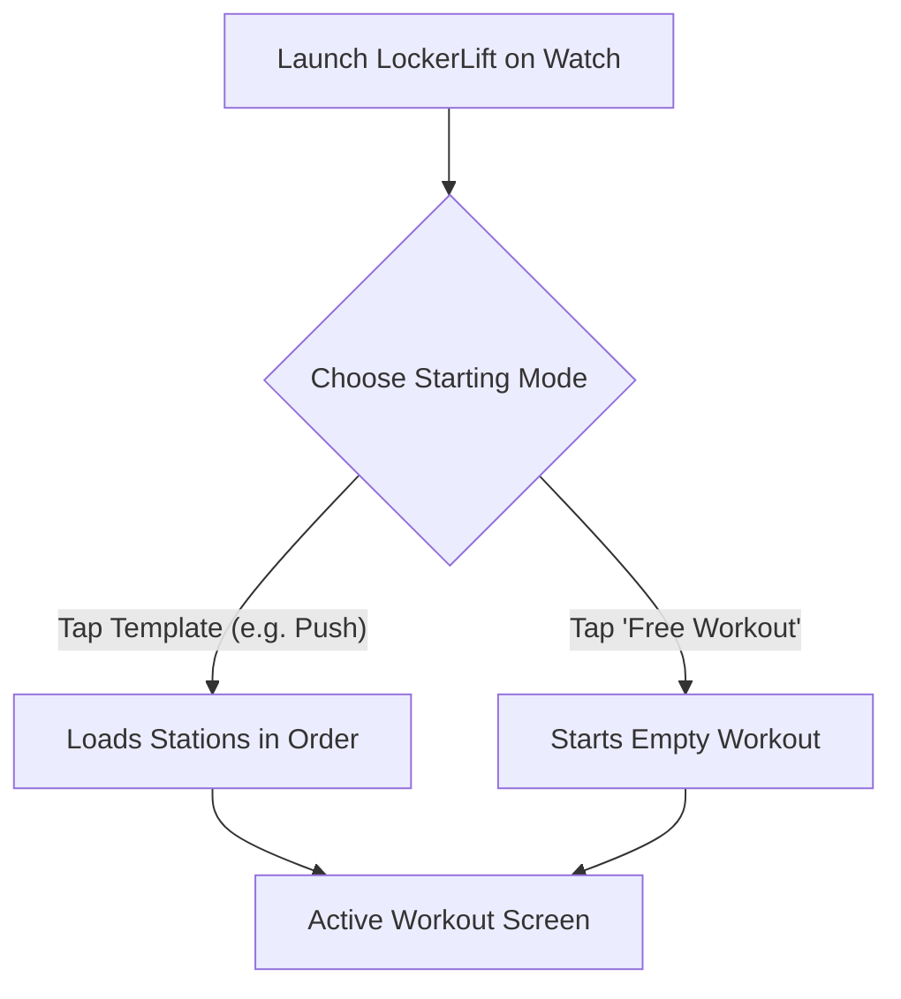
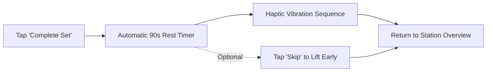

# ⌚ Wear OS Smartwatch Tracking Guide

> **Your comprehensive guide to logging sets, utilizing rotary bezel input, leveraging Double Progression, and managing workouts entirely on your smartwatch.**

---

[🚀 Starting a Workout](#-starting-a-workout) • [⚙️ Rotary Dial & Controls](#-rotary-dial--bezel-controls) • [📈 Double Progression](#-progressive-overload--double-progression) • [⏱️ Rest Timer & Haptics](#️-rest-timer--haptic-alerts) • [🔄 Ad-Hoc Exercises & Skipping](#-ad-hoc-exercises--skipping) • [💾 Finishing & Consolidation](#-finishing-the-workout--template-consolidation)

---

## 🚀 Starting a Workout

When you launch LockerLift on your Wear OS watch, you are presented with the **Template Selection Screen**:



### Option A: Selecting a Predefined Template
* Scroll through your synced templates (e.g., *Push*, *Pull*, *Legs*).
* Tap any template to immediately instantiate a workout session. The exercises and target weights will load in order.

### Option B: Free Workout (Ad-Hoc)
* If you do not follow a fixed schedule today, tap **Free Workout**.
* You can add stations on the fly as you move around the gym floor.

> [!NOTE]
> Starting an active workout automatically initiates LockerLift's **`WorkoutForegroundService`**. This registers an ongoing activity notification and keeps the tracking engine active even when the screen enters low-power Ambient Mode.

---

## ⚙️ Rotary Dial & Bezel Controls

LockerLift is optimized for round displays and physical hardware dials:

```text
    ┌─────────────────────────┐
    │     Lat Pulldown        │
    │        Set 1            │
    │  [-]   62.5 kg   [+]    │  <-- Physical bezel scrolls weight
    │  [-]   10 reps   [+]    │  <-- Quick tap buttons for exact adjustments
    │                         │
    │   [ Complete Set ]      │
    └─────────────────────────┘
```

### How to Adjust Values:
1. **Physical Bezel / Crown:** Rotate the bezel clockwise to increase weight or reps; rotate counter-clockwise to decrease. Tactile haptic clicks confirm each detent step.
2. **Quick Buttons (`+` / `-`):** Tap the `+` or `-` buttons to step in increments matching the machine's configured `defaultIncrementKg` (e.g., 2.5 kg or 1.25 kg).
3. **Rep Incrementing:** Quick buttons increment or decrement single reps effortlessly with sweaty hands or gloves.

---

## 📈 Progressive Overload & Double Progression

LockerLift implements intelligent, on-wrist **Double Progression** to help you build strength systematically:

### What is Double Progression?
Instead of adding weight every workout, you first progress in repetitions within a target bracket (e.g., 8–12 reps) with a fixed weight. Once you hit the upper ceiling (12 reps), you increase the weight and drop back to the lower floor (8 reps).

### How LockerLift Guides You on the Watch:
* When you log a set that achieves or exceeds the target repetition threshold (default: 12 reps), LockerLift displays a **Progression Suggestion Card**:
  ```text
  ┌───────────────────────────────────┐
  │  💡 Suggestion: Increase +2.5 kg? │
  └───────────────────────────────────┘
  ```
* **One-Tap Overload:** Tapping this suggestion card automatically increases the working weight by the machine's exact increment for your next set.
* If you feel fatigued or choose not to increase yet, simply ignore the card.

---

## ⏱️ Rest Timer & Haptic Alerts

Recovery between heavy sets is critical for strength development:



### Rest Timer Features:
1. **Automatic Activation:** Immediately upon tapping **Complete Set**, the rest countdown screen appears.
2. **Multi-Pulse Haptic Vibration:** When the timer reaches `00:00`, your watch vibrates with a distinct multi-burst waveform. You don't need to look at your watch or listen for beeps over loud gym music.
3. **Skip Button:** Feeling ready earlier? Tap **Skip** at any time to return directly to your exercise list.

---

## 🔄 Ad-Hoc Exercises & Skipping

Gyms get crowded. If a piece of equipment is occupied or broken, LockerLift adapts without breaking your workout:

### Adding an Exercise Mid-Workout (Cold-Start)
1. On the **Active Workout Screen**, scroll to the bottom.
2. Tap **+ Add Exercise**.
3. A new station is created instantly with a default setup and added to your active routine.

### Skipping an Exercise
* If you cannot perform a scheduled station today, tap on the station card and choose **Skip**.
* The station is marked as `Skipped` (dimmed) and excluded from Health Connect set counts, but preserved for your history.

---

## 💾 Finishing the Workout & Template Consolidation

When you complete your training, scroll to the bottom and tap **Finish Workout**:

### The Template Consolidation Dialog
If you added new exercises, swapped stations, or adjusted your routine during the session, LockerLift asks:

> **"Save changes back into template?"**

* **Yes (Consolidate):** Your underlying workout template is updated so the new exercises appear next time automatically.
* **No (Keep Original):** Today's variations are saved solely to this specific workout history. Your master template remains untouched.

> [!TIP]
> This decoupling guarantees that spontaneous gym improvisations never accidentally ruin your carefully structured long-term training plans.

---

[Next: 📱 Mobile App & Catalog Guide ➔](mobile-user-guide.md)
